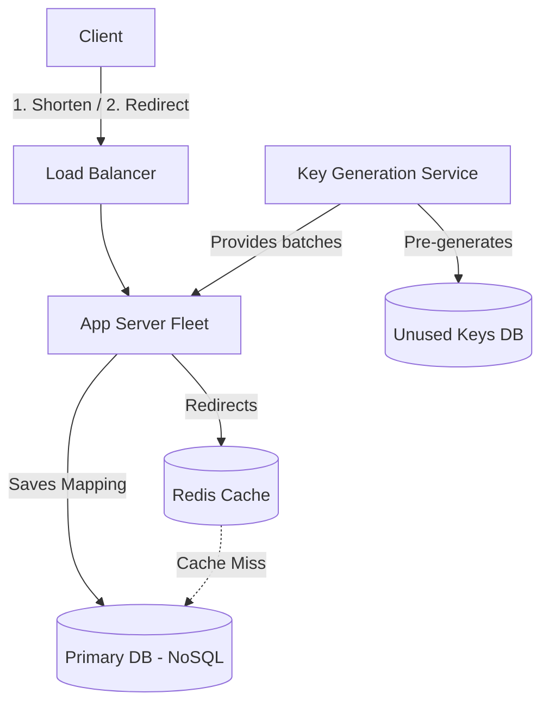

# 🔗 System Design: URL Shortener (TinyURL / Bitly)

## 📝 Overview
A distributed URL shortener service like Bitly or TinyURL creates short, unique aliases for long URLs. The system is characterized by an extreme read-heavy workload and must provide highly available, sub-millisecond redirections while preventing alias collisions at massive scale.

!!! abstract "Core Concepts"
    - **Base62 Encoding:** Converting base-10 numerical IDs into a short string of 62 alphanumeric characters (A-Z, a-z, 0-9) to create the shortest possible URL alias.
    - **Key Generation Service (KGS):** A standalone background service that pre-generates unique aliases to completely eliminate database write collisions and latency during URL creation.
    - **Read-Heavy Caching:** Aggressively caching popular URL mappings using LRU (Least Recently Used) eviction to protect the primary database from viral traffic spikes.

---

## 🏭 The Scenario & Requirements

### 😡 The Problem (The Villain)
Standard URLs are often hundreds of characters long, filled with tracking parameters and complex paths. They are impossible to memorize, break easily when copy-pasted, and consume too many characters for SMS or social media limits. Furthermore, generating millions of unique, random 6-character strings on the fly for every user request leads to expensive database collision checks and severe write latency.

### 🦸 The Solution (The Hero)
A highly available service that utilizes a dedicated Key Generation Service (KGS) to pre-compute millions of collision-free aliases, storing them in memory. When a user submits a long URL, the application server simply pops a pre-generated key and instantly saves the mapping. Combined with aggressive Redis caching, the system guarantees low-latency redirection.

### 📜 Requirements
- **Functional Requirements:**
    1. Users can submit a long URL and receive a short URL alias (e.g., `sho.rt/xyz123`).
    2. Clicking the short URL instantly redirects the user to the original long URL.
    3. Users can optionally specify a custom alias (e.g., `sho.rt/my-custom-name`).
- **Non-Functional Requirements:**
    1. **High Availability:** The redirection service must never go down (a single minute of downtime breaks millions of links across the internet).
    2. **Low Latency:** Redirection must happen in < 50ms.
    3. **Unpredictability (Optional):** Short links should not be easily guessable to prevent scraping.

!!! info "Capacity Estimation (Back-of-the-envelope)"
    - **Traffic:** 100M new URLs generated per month. 1 Billion redirections (reads) per month $\rightarrow$ **10:1 Read/Write ratio**.
    - **Storage:** 100M URLs/month * 500 bytes (average mapping size) = 50GB/month. Over 5 years $\rightarrow$ **~3TB of storage**.
    - **Memory/Cache:** Following the 80/20 rule, we cache 20% of the daily read requests. 33M reads/day * 0.20 * 500 bytes $\rightarrow$ **~3.3GB of RAM needed** (easily fits on a single Redis node).
    - **Bandwidth:** 400 writes/sec * 500 bytes = 200 KB/s ingress. 4,000 reads/sec * 500 bytes = 2 MB/s egress.

---

## 📊 API Design & Data Model

=== "REST APIs"
    - **`POST /api/v1/shorten`**
        - **Request:** `{ "long_url": "https://example.com/very/long/path?param=1", "custom_alias": "my-promo" }`
        - **Response:** `{ "short_url": "https://sho.rt/xyz123", "created_at": "2023-10-27T10:00:00Z" }`
    - **`GET /{alias}`**
        - **Request:** `GET /xyz123`
        - **Response:** `301 Moved Permanently` (Location: `https://example.com/...`)

=== "Database Schema"
    - **Table:** `url_mappings` (NoSQL / DynamoDB / Cassandra)
        - `hash` (String, PK) - e.g., "xyz123"
        - `original_url` (String)
        - `user_id` (String, Indexed)
        - `created_at` (Timestamp)
        - `expiration_date` (Timestamp)
    - **Table:** `unused_keys` (RDBMS or Key-Value for KGS)
        - `hash` (String, PK)
        - `is_used` (Boolean)

---

## 🏗️ High-Level Architecture

### Architecture Diagram

### Component Walkthrough

1.  **Load Balancer:** Distributes incoming read (redirect) and write (shorten) traffic across stateless application servers.
2.  **App Servers:** Stateless workers. For reads, they check the cache. For writes, they fetch an unused short alias from local memory (provided by the KGS) and store the mapping in the primary database.
3.  **Key Generation Service (KGS):** A background daemon that continually generates random 6-character Base62 strings, ensures they don't already exist, and stores them in an `unused_keys` database. It doles out batches of these keys to App Servers to keep in memory.
4.  **Cache (Redis):** Stores the most heavily accessed `hash -> original_url` mappings to ensure sub-10ms response times and protect the DB from read spikes.
5.  **Primary DB:** A highly scalable NoSQL database (like Cassandra or DynamoDB) chosen for its ability to effortlessly scale to terabytes of simple Key-Value data without complex JOINs.

-----

## 🔬 Deep Dive & Scalability

### Handling Bottlenecks

**The Key Generation Problem**
If the App Server generates a random 6-character string dynamically on every request, it must query the database to ensure the string hasn't been used before. As the database fills up, collisions become highly probable, forcing the server to retry multiple times, causing severe latency.

*The Fix: KGS Pre-computation*
The Key Generation Service solves this by pre-computing millions of keys offline. The KGS assigns a "batch" of keys (e.g., 10,000 keys) to a specific App Server. The App Server loads these into RAM. When a shorten request arrives, the App Server simply pops a key from RAM in $O(1)$ time and saves the mapping. If the App Server crashes, the batch of 10,000 keys is lost, which is perfectly acceptable given a 6-character Base62 string provides \~56.8 billion combinations.

### ⚖️ Trade-offs

| Decision | Pros | Cons / Limitations |
| :--- | :--- | :--- |
| **301 vs 302 HTTP Redirect** | **301 (Permanent)** caches the redirect in the user's browser, vastly reducing server load. **302 (Temporary)** forces the browser to hit the server every time. | 301 destroys your ability to track analytics (click rates, locations). Use 302 if click analytics are a core business requirement. |
| **Base62 vs MD5 Hash** | Base62 (A-Z, a-z, 0-9) allows exactly 6-7 characters to represent billions of URLs cleanly. | MD5 hashes are too long (32 chars). You'd have to truncate them to 6 chars, massively increasing collision probability. |
| **NoSQL vs RDBMS** | Scales horizontally with ease for massive read/write volumes. | Relational DBs offer ACID properties, which might be preferred if tracking precise billing or strict user quotas is necessary. |

-----

## 🎤 Interview Toolkit

  - **Scale Question:** "A specific short URL belonging to a celebrity goes viral and is clicked 100,000 times a second. How do you survive?" -\> *Rely on the Redis Cache. A properly tuned Redis cluster can handle hundreds of thousands of reads per second. Ensure the Load Balancer routes traffic effectively, and perhaps use a local in-memory cache (like Guava) on the App Servers themselves for extreme hot-keys.*
  - **Failure Probe:** "What happens if the Key Generation Service (KGS) crashes?" -\> *Since App Servers keep a batch of thousands of keys in their local RAM, they can continue serving write requests for several minutes/hours while the KGS is restarted. The system is resilient to brief KGS outages.*
  - **Edge Case:** "How do you handle a malicious user submitting a URL that redirects back to your own shortener, creating an infinite redirect loop?" -\> *Implement loop detection at the App Server level. When accepting a long URL, check if the domain matches your own (e.g., `sho.rt`). If it does, reject the request. Additionally, set a strict `Max-Forwards` header limit.*

## 🔗 Related Architectures

  - [Machine Coding: Cache System](../../../machine_coding/systems/cache_system/PROBLEM.md) — Excellent for understanding the LRU mechanisms protecting the DB.
  - [System Design: Twitter Feed (Snowflake ID)](../social_media/TWITTER_HLD.md) — Alternative method for generating unique IDs in distributed systems.
