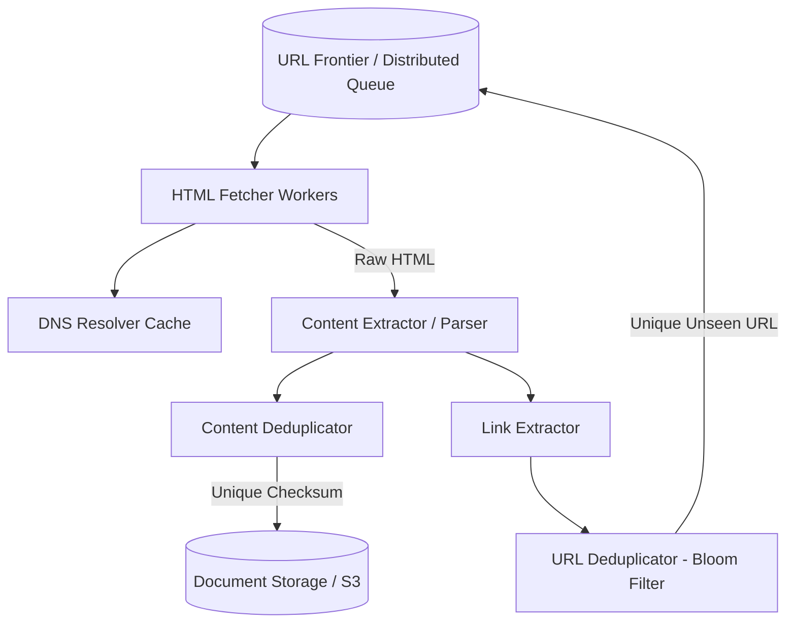

# 🕷️ System Design: Web Crawler (Search Engine Indexing)

## 📝 Overview
A web crawler is an automated distributed system that systematically browses the World Wide Web to extract content and build indexes for search engines. The core challenge is managing a massive, infinite state machine without getting trapped in cyclical loops, while strictly respecting the bandwidth and resources of the target web servers.

!!! abstract "Core Concepts"
    - **Breadth-First Search (BFS):** The primary graph traversal algorithm used, where URLs are edges and web pages are nodes.
    - **The Politeness Guarantee:** Architecting the crawler to mathematically guarantee it will not launch a DoS attack on a target web server by rate-limiting domain requests.
    - **Bloom Filters & Checksums:** Space-efficient probabilistic data structures and hashing algorithms used for massive-scale URL and content deduplication.

---

## 🏭 The Scenario & Requirements

### 😡 The Problem (The Villain)
The internet is essentially infinite and full of poorly configured sites. If a crawler aggressively follows every link it sees, it can easily fall into "spider traps" (infinite cyclical directories) or accidentally execute a Distributed Denial of Service (DDoS) attack on a small web server by fetching thousands of its pages simultaneously.

### 🦸 The Solution (The Hero)
A highly distributed, BFS-based crawler centered around a "URL Frontier" that strictly governs pacing. By hashing canonical hostnames to specific worker queues, the system inherently serializes requests to individual domains. Paired with Bloom Filters to quickly discard previously seen URLs, the crawler efficiently navigates the web without overwhelming any single node.

### 📜 Requirements
- **Functional Requirements:**
    1. The system must fetch web pages starting from a set of seed URLs.
    2. It must extract text content and outbound links from the HTML.
    3. It must store the unique content and add new, unseen links back to the crawling queue.
- **Non-Functional Requirements:**
    1. **Politeness:** The crawler must never overwhelm a target web server (strict rate limiting per domain).
    2. **Fault Tolerance:** Crawling billions of pages takes weeks; the system must seamlessly recover from worker node crashes without restarting from scratch.
    3. **Scalability:** Must horizontally scale to handle thousands of concurrent page fetches per second.

!!! info "Capacity Estimation (Back-of-the-envelope)"
    - **Traffic / Throughput:** Crawling 15 Billion pages within 4 weeks (28 days) requires fetching approximately **~6,200 pages/sec (QPS)**.
    - **Storage (Content):** At an average of 100KB per HTML page, 15 billion pages demand **1.5 PB** of raw storage. With a typical 3x replication factor, this expands to **~4.5 PB**.
    - **Memory (URL Deduplication):** Storing 8-byte checksums (or using a Bloom Filter) for 15 billion documents requires roughly **120 GB of RAM** to handle real-time duplicate checks without hitting the disk.

---

## 📊 API Design & Data Model

=== "Internal Worker APIs"
    - **`POST /api/v1/crawl/seed`** *(Admin endpoint to start/add to a crawl)*
        - **Request:** `{ "urls": ["https://en.wikipedia.org", "https://news.ycombinator.com"] }`
        - **Response:** `202 Accepted`
    - **`GET /api/v1/frontier/batch`** *(Worker pulling URLs to fetch)*
        - **Request:** `{ "worker_id": "w-789", "capacity": 50 }`
        - **Response:** `{ "urls": ["https://...", ...] }`

=== "Database Schema"
    - **Blob Storage:** `documents` (S3 / GFS)
        - `doc_hash` (String, PK) - e.g., "a1b2c3d4"
        - `content` (Raw HTML/Text Blob)
    - **NoSQL / KV Store:** `url_metadata` (Cassandra / DynamoDB)
        - `url_hash` (String, PK)
        - `original_url` (String)
        - `last_crawled_at` (Timestamp)
        - `http_status` (Int)
    - **Queue / State:** `url_frontier` (Kafka / Custom Distributed Queue)
        - *Partitioned by: `hostname_hash`*
        - `url` (String)
        - `priority` (Int)

---

## 🏗️ High-Level Architecture

### Architecture Diagram

### Component Walkthrough

1.  **URL Frontier:** The brain of the crawler. It stores the URLs to be downloaded, prioritizes them, and enforces politeness constraints.
2.  **HTML Fetcher:** Worker threads that take URLs from the Frontier, resolve the IP via the DNS Cache, and download the web page.
3.  **DNS Resolver Cache:** DNS lookups can take 10-200ms. Calling the ISP's DNS for every URL will severely bottleneck the Fetcher. A local DNS cache is mandatory.
4.  **Content & Link Extractors:** Parses the HTML DOM to extract the raw text for the search index and pulls all outbound `<a href>` links to continue the crawl.
5.  **Deduplicators:** Uses caching and probabilistic data structures to ensure the exact same web page or URL isn't processed twice.

-----

## 🔬 Deep Dive & Scalability

### Handling Bottlenecks

**The URL Frontier & The Politeness Guarantee**
The absolute strictest constraint of a web crawler is Politeness. To prevent a DoS attack on a target server, the URL Frontier utilizes a heavily coordinated architecture based on **canonical hostname hashing**.

  - **Distinct FIFO Sub-queues:** The URL Frontier does not use a single global pool of URLs. Instead, it maintains distinct FIFO sub-queues. Each individual worker thread is assigned its own exclusive sub-queue.
  - **Hostname Hashing:** When a new URL is discovered, the crawler extracts the canonical hostname (e.g., `wikipedia.org`). A hash function is applied to this hostname, mapping it to a specific thread number/queue.
  - **Serialization:** Because all URLs for a specific web server are routed to the *exact same* FIFO sub-queue, and that queue is processed sequentially by only *one* dedicated worker thread, it is structurally impossible for multiple threads to concurrently hit the same web server.

**Massive Scale Deduplication**
The web is full of cyclical links and redundant content (e.g., identical articles hosted on different domains).

  - **URL Deduplication (Bloom Filters):** Before adding a link to the Frontier, the system checks if it has been visited. Checking a 15-billion row SQL database for every extracted link is too slow. The system uses an in-memory **Bloom Filter**—if the filter says "No," the URL is definitely new. If it says "Yes," the crawler does a slower fallback check against the persistent cache to confirm.
  - **Content Deduplication (Checksums):** Before saving a massive HTML document, the crawler generates a cryptographic hash (MD5 or SHA-256) of the text. This 8-byte checksum is compared against the global cache. If it exists, the raw HTML is discarded, saving Petabytes of storage.

**Fault Tolerance & Snapshotting**
If a worker node crashes halfway through a 4-week crawl, the system cannot restart. The URL Frontier and the Deduplication filters periodically serialize their state (snapshots) to persistent disk. When a worker recovers, it simply loads the last snapshot and resumes from the exact URL offset where it left off.

### ⚖️ Trade-offs

| Decision | Pros | Cons / Limitations |
| :--- | :--- | :--- |
| **Breadth-First Search (BFS) vs DFS** | Discovers high-quality, top-level pages first. Naturally spreads load across many domains. | Requires massive memory to store the frontier of wide unvisited links. |
| **Bloom Filter vs Distributed Hash Table** | Extremely memory efficient (fits billions of URLs in RAM). $O(1)$ fast lookups. | Probabilistic (false positives are possible). You cannot remove items from a standard Bloom Filter once added. |
| **In-Memory DNS Cache vs Standard DNS** | Eliminates the 10-200ms latency of network DNS resolution, unblocking Fetcher threads. | Requires custom daemon management. DNS records can become stale if IP addresses change rapidly. |

-----

## 🎤 Interview Toolkit

  - **Scale Question:** "Your fetcher threads are mostly sitting idle, CPU is at 10%, but throughput is terrible. What's the bottleneck?" -\> *DNS Resolution. If the workers are making synchronous network calls to a public DNS server for every URL, they will spend 90% of their time blocked on network I/O. You must implement asynchronous I/O and a localized DNS cache.*
  - **Failure Probe:** "How do you handle 'Spider Traps' (dynamically generated infinite directories like `site.com/a/b/c/d...`)?" -\> *Implement a strict URL depth limit (e.g., max 10 paths deep). Additionally, normalize URLs before deduplication (e.g., convert to lowercase, remove tracking parameters like `?utm_source=...`) to prevent treating structurally identical pages as unique URLs.*
  - **Edge Case:** "A website admin updates their `robots.txt` to disallow crawling while your system is actively processing their domain. How do you respect it?" -\> *The Fetcher must periodically re-download and cache the `robots.txt` file for every active domain (e.g., cache TTL of 24 hours). Before making an HTTP request, the worker strictly validates the target path against the locally cached `robots.txt` rules.*

## 🔗 Related Architectures

  - [Architecture Patterns: Bloom Filters](../../pillars/ARCHITECTURE_PATTERNS.md) — Deep dive into the probabilistic structures powering the deduplicator.
  - [Mastery Program: Module 8 - Message Queues](../../mastery_program/phase_2/m8_queues.md) — Understanding the distributed log mechanisms behind the URL Frontier.
  - [System Design: Web Search Indexing](../search_systems/TWITTER_SEARCH.md) — How the extracted text is actually made searchable after the crawler stores it.
