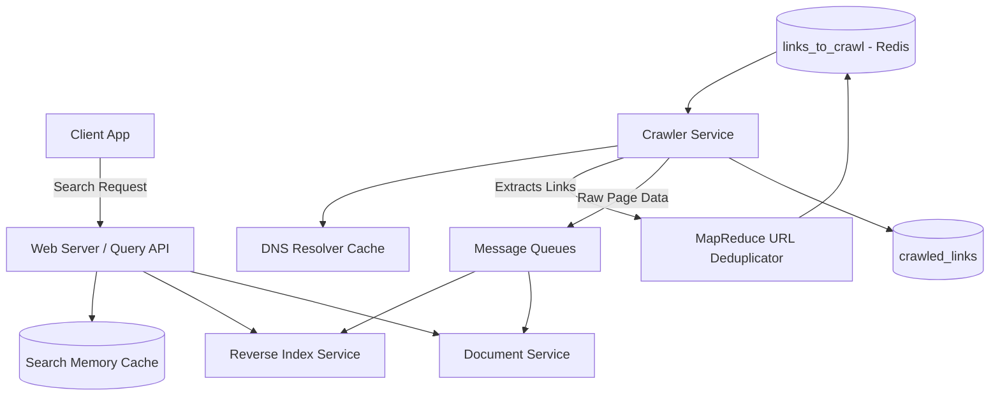

# 🕷️ System Design: Web Crawler & Search Indexer

## 📝 Overview
A web crawler is an automated distributed system that systematically browses the World Wide Web to extract content, generate reverse indexes, and build titles/snippets for search engines. The core challenge is managing a massive, infinite state machine without getting trapped in cyclical loops, while serving high-volume, low-latency search queries to users.

!!! abstract "Core Concepts"
    - **Breadth-First Search (BFS) & Politeness:** Traversing the web graph while mathematically guaranteeing the crawler won't launch a DoS attack on a target web server.
    - **Reverse Indexing:** Mapping individual words/search terms back to the documents (URLs) that contain them to enable lightning-fast search queries.
    - **Content Signatures:** Generating signatures using algorithms like Jaccard index or Cosine similarity to detect and deduplicate similar HTML content.
    - **Connection Pooling & DNS Caching:** Keeping multiple open connections and locally caching IP addresses to prevent network I/O from bottlenecking the fetcher threads.

---

## 🏭 The Scenario & Requirements

### 😡 The Problem (The Villain)
The internet is essentially infinite and full of poorly configured sites. If a crawler aggressively follows every link it sees, it can easily fall into "spider traps" (infinite cyclical directories) or accidentally execute a Distributed Denial of Service (DDoS) attack. Furthermore, once data is fetched, searching across billions of unstructured HTML documents in real-time is impossible without highly optimized indexing.

### 🦸 The Solution (The Hero)
A highly distributed crawler centered around a prioritized "URL Frontier" that strictly governs pacing. It seamlessly pipes fetched pages into asynchronous queues to build a Reverse Index and a Document Store (for static titles and snippets). When a user searches, a dedicated Query API normalizes the input and scatter-gathers the results from the indexed clusters.

### 📜 Requirements
- **Functional Requirements:**
    1. The system must fetch web pages starting from a list of prioritized seed URLs.
    2. It must generate a reverse index of words to pages.
    3. It must generate and store static titles and snippets for pages.
    4. Users can input a search term and see a list of relevant pages.
- **Non-Functional Requirements:**
    1. **Politeness & Cycle Prevention:** The crawler must never overwhelm a server or get stuck in an infinite loop.
    2. **High Availability & Speed:** The search generation must be fast, and the service must be highly available.
    3. **Freshness:** Pages must be recrawled regularly based on their update frequency.

!!! info "Capacity Estimation (Back-of-the-envelope)"
    - **Traffic (Crawling):** 1 Billion target links. Crawled approx. once per week $\rightarrow$ **4 Billion links crawled per month**.
    - **Throughput (Writes):** 4 Billion / 2.5M seconds = **~1,600 write requests/sec**.
    - **Traffic (Searching):** 100 Billion searches per month $\rightarrow$ **~40,000 search requests/sec**.
    - **Storage (Content):** 500 KB average per page * 4 Billion pages = **2 PB of new/updated content per month**.
    - **Total Storage:** Over 3 years, this scales to **~72 PB** of stored page content.

---

## 📊 API Design & Data Model

=== "REST APIs"
    - **`GET /api/v1/search`** *(Public Search Endpoint)*
        - **Query Params:** `?query=hello+world`
        - **Response:** ```json
          [
            {
              "title": "foo's title",
              "snippet": "foo's snippet",
              "link": "[https://foo.com](https://foo.com)"
            }
          ]
          ```

=== "Database Schema"
    - **NoSQL / KV Store:** `links_to_crawl` (Redis Sorted Sets)
        - `url` (String, PK)
        - `priority` (Float) - Determines crawl order
    - **NoSQL / KV Store:** `crawled_links` (Cassandra / DynamoDB)
        - `url` (String, PK)
        - `signature` (String) - Content hash/signature
        - `last_crawled_at` (Timestamp)
    - **Search Databases:** (Lucene / Elasticsearch)
        - `Reverse Index Store:` Maps `word` $\rightarrow$ `List<url>`
        - `Document Store:` Maps `url` $\rightarrow$ `{title, snippet}`

---

## 🏗️ High-Level Architecture


### Architecture Diagram


### Component Walkthrough

1.  **Crawler Service:** Pulls the highest priority URL from the `links_to_crawl` NoSQL store. It checks for similar content signatures in `crawled_links`. If unique, it fetches the page, extracts child URLs, generates a signature, and pushes the page data into asynchronous queues.
2.  **Reverse Index Service:** Consumes from the queue, tokenizes the text, and maps individual words back to the URL.
3.  **Document Service:** Consumes from the queue to generate and store the static HTML title and short text snippet for the search results page.
4.  **Query API:** When a user searches, this server parses the query (removes markup, fixes typos, normalizes capitalization, handles boolean ops), hits the Reverse Index to rank matching documents, and uses the Document Service to hydrate the titles/snippets.
5.  **Memory Cache:** Sits in front of the Query API to serve popular search queries instantly (e.g., Redis/Memcached).

-----

## 🔬 Deep Dive & Scalability

### Handling Bottlenecks

**Crawling Bottlenecks & Network I/O**
Fetching web pages is incredibly bandwidth-intensive.

  - **Connection Pooling:** The Crawler Service improves performance and reduces memory overhead by maintaining many open, reusable connections rather than spinning up new TCP handshakes for every request.
  - **DNS Caching:** DNS lookups can cripple throughput. The Crawler Service maintains its own local DNS cache that is refreshed periodically.

**Search Scalability**
With 40,000 search requests per second, the search cluster will melt without aggressive scaling:

  - **Query Caching:** Because search traffic is not evenly distributed (some queries are incredibly popular), a Memory Cache handles the bulk of the repetitive read load. Reading 1 MB sequentially from RAM takes \~250 microseconds, 80x faster than disk.
  - **Sharding & Federation:** The Reverse Index Service and Document Service must make heavy use of sharding (e.g., partitioning the index by alphabet/terms) to handle the 72 PB data size and request load.

**Massive Scale Deduplication**

  - **URL Deduplication (MapReduce):** For 1 billion initial links, running `sort | unique` fails. We use a MapReduce job that yields `(url, 1)` and only reduces/keeps URLs with a total frequency of `1`.
  - **Content Deduplication (Signatures):** Detecting duplicate content is complex because pages might have slightly different timestamps or dynamic ads. The crawler uses algorithms like the **Jaccard index** or **Cosine similarity** to generate a page signature. If a crawled page matches an existing signature in `crawled_links`, its priority is heavily reduced to avoid cyclical traps.

### Determining Crawl Frequency

Pages need to be crawled regularly to ensure freshness. The system uses data mining on the `last_crawled_at` timestamp to determine the mean time before a particular page is updated, using that statistic to prioritize dynamic sites (e.g., news portals) over static sites.

### ⚖️ Trade-offs

| Decision | Pros | Cons / Limitations |
| :--- | :--- | :--- |
| **SQL vs NoSQL** | SQL offers strict ACID properties. | NoSQL (Key-Value/Wide-Column) scales horizontally much better for the 1,600 writes/sec and massive 72 PB dataset. |
| **TCP vs UDP for Crawler** | TCP guarantees packet delivery and is standard for HTTP. | Switching custom fetchers to UDP could technically boost performance but sacrifices reliability and standard web compatibility. |

-----

## 🎤 Interview Toolkit

  - **Scale Question:** "Your fetcher threads are mostly sitting idle, CPU is at 10%, but throughput is terrible. What's the bottleneck?" -\> *DNS Resolution and Connection Setup. Ensure the workers are using a localized DNS cache and Connection Pooling to avoid being blocked on continuous network I/O.*
  - **Failure Probe:** "How do you handle 'Spider Traps' (infinite cyclical directories)?" -\> *Rely on the page signature (Cosine similarity). Even if the URL structure changes dynamically, the actual text content signature will be flagged as highly similar to previously crawled pages, allowing the crawler to lower its priority and break the cycle.*
  - **Edge Case:** "How do you ensure search queries with typos still return results?" -\> *The Query API must implement a robust text normalization pipeline before hitting the Reverse Index. This includes breaking text into terms, stripping markup, stemming words, and applying typo-correction algorithms (like Levenshtein distance matching).*

## 🔗 Related Architectures

  - [Architecture Patterns: MapReduce](../../pillars/ARCHITECTURE_PATTERNS.md) — Deep dive into offline URL deduplication and hit counting.
  - [System Design: Twitter Search](../search_systems/TWITTER_SEARCH.md) — Excellent parallel for understanding how early-stage reverse indexing works on text streams.
