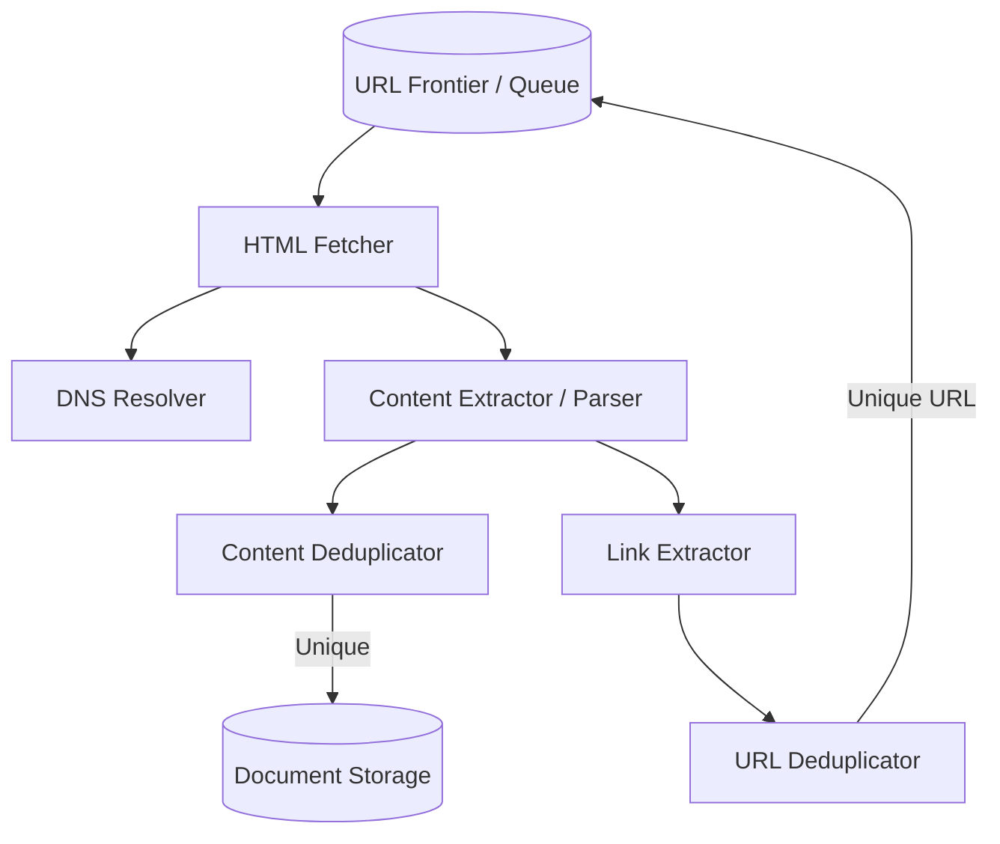

# Design: Web Crawler (Search Engine Indexing)

A web crawler is an automated script that systematically browses the World Wide Web to extract content and build indexes for search engines. The core challenge is managing a massive, infinite state machine without getting stuck in loops and respecting the resources of the web servers being crawled.

---

## 1. Capacity Estimation & Scale

*   **Traffic:** Crawling **15 Billion pages within 4 weeks** requires fetching approximately **6,200 pages/sec (QPS)**.
*   **Storage:** At an average of **100KB per HTML page**, 15 billion pages demand **1.5 PB** of raw storage (expanding to **2.1 PB** with a typical 70% capacity model for replicas).
*   **Memory (Deduplication):** Storing 8-byte checksums for 15 billion documents requires **120 GB of RAM** or high-performance database memory to handle real-time duplicate checks.

---

## 2. High-Level Architecture

The crawler utilizes a **Breadth-First Search (BFS)** graph traversal algorithm, where URLs are edges and web pages are nodes.

---

## 3. Component Deep Dives

### A. The URL Frontier (The Brain)
The **URL Frontier** dictates the "what" and "when" of the crawling process. It must balance two competing priorities:

*   **Politeness Constraint:** The crawler must not perform a DoS attack on a website. The Frontier manages this by maintaining separate FIFO queues mapped to specific domain names. A worker thread only pulls from a single domain queue, enforcing a required delay between requests to the same host.
*   **Prioritization:** The Frontier ranks URLs based on **PageRank**, update frequency (e.g., news sites vs. static archives), and URL depth to ensure the most valuable content is crawled first.

The URL Frontier is the brain of the crawler. It dictates what to crawl and when to crawl it. The absolute strictest constraint of a web crawler is Politeness—it must mathematically guarantee that it will not launch a DoS attack on a target web server.

To achieve this, the URL Frontier utilizes a heavily coordinated architecture based on canonical hostname hashing:

*   Distinct FIFO Sub-queues: Within each crawling server, the URL Frontier does not use a global pool of URLs. Instead, it maintains a collection of distinct FIFO (First-In-First-Out) sub-queues. Each individual worker thread is assigned its own exclusive sub-queue.

*   Canonical Hostname Hashing: When the crawler discovers a new URL, it extracts the URL's canonical hostname (e.g., wikipedia.org). A hash function is applied directly to this hostname, which maps it to a specific thread number.

*   The Politeness Guarantee: By tying the queue assignment strictly to the hash of the hostname, the system guarantees that all URLs belonging to a specific web server are routed to the exact same FIFO sub-queue.

*   Serialization: Because each sub-queue is processed sequentially by only one dedicated worker thread, it is structurally impossible for multiple threads to concurrently hit the same web server. This protects the target server from connection spikes and inherently serializes the download requests.

### B. Deduplication Strategies
The web is full of identical content hosted on different domains and cyclical links that trap crawlers in infinite loops. To maintain efficiency:

*   **URL Deduplication:** Before adding a link to the Frontier, the system checks if it has already been visited using a **Bloom Filter** (a space-efficient probabilistic data structure).
*   **Content Deduplication:** Before saving a document, the crawler generates a cryptographic hash (e.g., MD5 or SHA) of the text content. This 8-byte checksum is compared against the global deduplication cache to avoid storing redundant data.

### C. Fault Tolerance & Snapshotting
Crawling billions of pages takes weeks. If a worker node crashes, the system must resume without restarting:

*   **Distributed Queuing:** The URL Frontier is typically built on a distributed log like **Apache Kafka** or a custom persistent database.
*   **Snapshotting:** The URL Frontier is a massive distributed queue (often built on Kafka or a custom database). The system periodically serializes the state of the Frontier and the deduplication filter to disk, allowing workers to resume from the exact URL offset where they left off.

---

## 4. Related Architectures & Patterns

*   **Bloom Filters Deep Dive:** [Architecture Patterns](../../pillars/ARCHITECTURE_PATTERNS.md#3-bloom-filters)
*   **Message Queues:** [Mastery Program: Module 8](../../mastery_program/phase_2/m8_queues.md)
