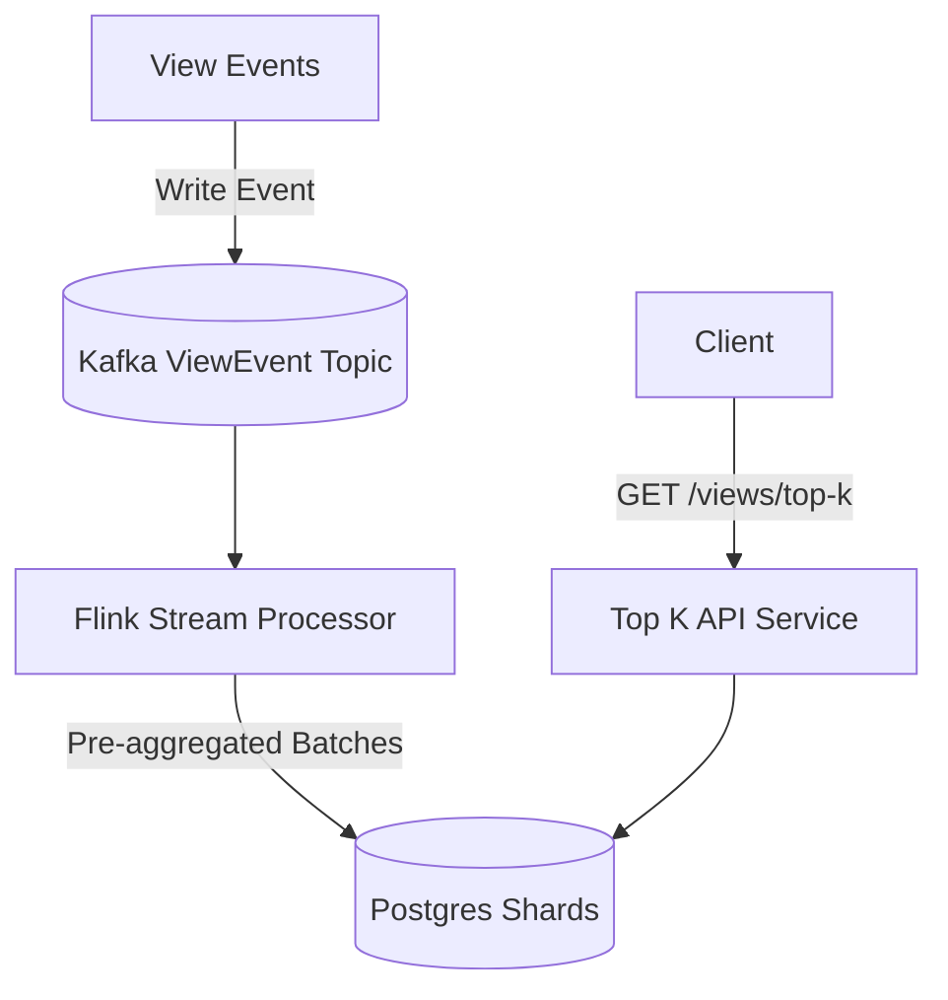

# 📈 System Design: YouTube Top K Videos

## 📝 Overview
A real-time analytics system designed to precisely calculate the top K most-viewed videos on YouTube across various time horizons. It leverages stream processing and aggressive pre-aggregation to ingest massive view firehoses while serving low-latency leaderboard queries.

!!! abstract "Core Concepts"
    - **Tumbling vs. Sliding Windows:** Distinguishing between strict, non-overlapping time buckets (tumbling) versus continuously shifting timeframes (sliding).
    - **Stream Processing:** Using frameworks like Flink to handle batching and out-of-order events at massive scale.
    - **Count-Min Sketch (CMS):** A probabilistic data structure used to trade precision for significant memory savings when exact counts are not strictly required.
    - **Scaling Writes:** Utilizing sharding and stream buffering to prevent databases from melting under millions of write operations per second.

---

## 🏭 The Scenario & Requirements

### 😡 The Problem (The Villain)
Calculating the "Top K" of anything from a firehose of events at scale is incredibly resource-intensive. If a system attempts to store every single video view directly in a traditional database and run `GROUP BY` aggregations on the fly to find the most viewed videos, the query will need to process hundreds of gigabytes of data and take minutes or hours to return. This prevents clients from getting fast, real-time results.

### 🦸 The Solution (The Hero)
A stream processing architecture that buffers raw view events in a highly available queue (Kafka), pre-aggregates the data in real-time using a stream processor (Flink), and writes the aggregated metrics to a sharded database optimized for lightning-fast reads.

### 📜 Requirements
- **Functional Requirements:**
    1. Clients should be able to query the top K videos for all-time (up to a max of 1k results).
    2. Clients should be able to query *tumbling windows* of 1 hour, 1 day, and 1 month (up to a max of 1k results).
- **Non-Functional Requirements:**
    1. The system must tolerate at most a 1-minute delay between a view occurring and it being tabulated.
    2. Results must be precise (no approximation allowed initially).
    3. The system must return queries within 10s of milliseconds.
    4. The system must support a massive number of views per second and billions of videos.
- **Out of Scope:**
    1. Arbitrary time periods and sliding windows (for the initial scope).

!!! info "Capacity Estimation (Back-of-the-envelope)"
    - **Traffic:** ~70 billion views per day translates to roughly 700,000 transactions per second (TPS).
    - **Storage:** Storing a naive counter for 4 billion videos requires ~64 GB of storage per time window (8 bytes per ID + 8 bytes per count).

---

## 📊 API Design & Data Model

=== "REST APIs"
    - **`GET /views/top-k`**
        - **Request:** `?window=1h&k=100`
        - **Response:** `[ { "videoId": "vid123", "views": 1500000 }, ... ]`
        - *Note: Pagination is avoided because results are strictly capped at the top 1,000 records.*

=== "Database Schema"
    - **Table:** `VideoViews_AllTime` (Relational / Postgres)
        - `video_id` (String, PK)
        - `views` (Integer, Indexed)
    - **Table:** `VideoViews_LastHour` (Relational / Postgres)
        - `video_id` (String, PK)
        - `window_timestamp` (Timestamp, Indexed)
        - `views` (Integer, Indexed)

---

## 🏗️ High-Level Architecture

### Architecture Diagram

### Component Walkthrough
1. **Kafka Stream:** Buffers the firehose of incoming view events. The topic is partitioned by the `video_id` to ensure events for the same video are processed in order by the same consumer.
2. **Flink Stream Processor:** Consumes events from Kafka, handles late-arriving events using watermark strategies, and aggregates views using 1-minute/1-hour tumbling windows. 
3. **Database (Postgres):** Stores the aggregated view counts. It maintains B-tree indexes on the `views` column, meaning the database can fetch the top K videos in $O(k)$ time without scanning the entire table.
4. **Top K API Service:** Receives the client request, queries the database (or shards), and returns the fast, pre-computed results.

---

## 🔬 Deep Dive & Scalability

### Handling Extreme Write Throughput
700,000 writes per second will overwhelm a single Postgres database. We address this through two mechanisms:
- **Batching:** Instead of writing to the database for every single view, Flink aggregates the views in memory over a defined time window (e.g., 1 minute). Since many views hit a small number of viral videos, this drastically reduces the number of database inserts.
- **Sharding:** We horizontally partition the database by `video_id`. Each Flink consumer writes to its specific database shard. When reading the top K, the API service queries the top K from *each* shard and merges the results in memory to find the global top K.

### Sliding vs. Tumbling Windows
While tumbling windows (e.g., 9:00 to 10:00) are simple because they just append data, sliding windows (e.g., the exact last 60 minutes) are much more complex. 
To implement sliding windows, the system must add new views while simultaneously subtracting views that just expired out of the window. This requires storing minute-grained data and applying a continuous "increment current minute, decrement T-60 minute" logic to the aggregated counters. This significantly increases storage requirements and database load.

### ⚖️ Trade-offs
| Decision | Pros | Cons / Limitations |
| :--- | :--- | :--- |
| **Precise DB Counts vs. Count-Min Sketch (CMS)** | A database guarantees 100% precision for the analytics. | Requires massive storage (~64GB per window). CMS reduces this to megabytes but introduces fuzzy, approximate view counts. |
| **Postgres vs. Specialized DB (ClickHouse / TimescaleDB)** | Standard RDBMS primitives are highly flexible and well-understood in interviews. | Specialized OLAP or Time Series DBs natively handle time-based partitioning, rollups, and compression better out of the box. |
| **Tumbling vs. Sliding Windows** | Tumbling windows reduce memory overhead and simplify database updates. | The results represent fixed chunks of time, which may feel slightly stale to users expecting a continuously rolling "last hour" metric. |

---

## 🎤 Interview Toolkit

- **Mid-Level Expectations:** Should confidently construct the high-level design, properly defining the API endpoints and recognizing the need to buffer writes and use an index for fast $O(k)$ queries.
- **Senior Expectations:** Must drive the scalability deep dives. Expected to identify the 700k TPS bottleneck proactively, propose Kafka/Flink for batching and stream processing, and justify database choices over alternatives.
- **Staff+ Expectations:** Drive the conversation entirely. Expected to discuss advanced approximations like Count-Min Sketch (CMS) + Min-Heaps to save memory, debate the mechanics of sliding vs. tumbling windows in-depth, and evaluate specialized OLAP databases. 
- **Scale Question:** *(What if we need to support the "last hour" as a continuously sliding window?)* -> Store minute-grained aggregates and run a process that adds the newest minute while decrementing the minute that just fell outside the 60-minute window.

## 🔗 Related Architectures
- [Ad Click Aggregator](./AD_CLICK_AGGREGATOR.md) — Shares a nearly identical ingestion-heavy stream processing architecture, prioritizing write scalability and time-windowed aggregations.
<!-- - [Metrics Monitoring](./METRICS_MONITORING.md) — Utilizes similar time-series data storage and tumbling/sliding window aggregations. -->
