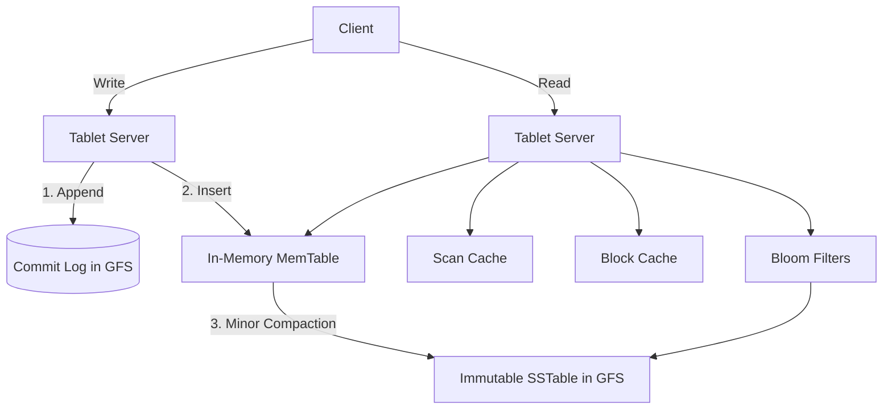

# Deep Dive: Google BigTable

BigTable is a distributed storage system for managing structured data designed to scale to a very large size: petabytes of data across thousands of commodity servers. It powers Google Search, Google Earth, and Google Analytics.

## 1. Data Model

BigTable is not a relational database. It is a sparse, distributed, persistent multi-dimensional sorted map.

**Map Structure:**  
`(row:string, column:string, time:int64) -> string`

**Rows:**  
Lexicographic sorting by row key ensures that related data is stored adjacently, allowing for highly optimized sequential reads (Range Scans).

**Column Families:**  
Columns are grouped into families, which form the basic unit of access control and memory accounting.

**Timestamps:**  
Every cell can contain multiple versions of the same data, indexed by timestamp (supporting garbage collection of old versions).

---

## 2. Core Architecture

BigTable relies heavily on other distributed systems within the Google ecosystem to function.

**Google File System (GFS):**  
BigTable stores its actual data and commit logs in GFS.

**Chubby:**  
BigTable uses the Chubby distributed lock service to ensure there is only one active Master, to discover Tablet Servers, and to store ACLs.

### Tablets and Tablet Servers

A BigTable cluster is dynamically partitioned into rows called **Tablets** (typically 100–200 MB in size).

**Tablet Servers** manage a set of Tablets (usually 10–1000 tablets per server). They handle all read and write requests for the tablets they manage.

**Master Server** assigns tablets to Tablet Servers, detects the addition and expiration of Tablet Servers, and handles schema changes.

---

## 3. The Read & Write Path (LSM Tree)

BigTable uses a **Log-Structured Merge-Tree (LSM)** architecture for extreme write throughput.

### The Read Path

- The server checks the **Scan Cache** (caches frequent key-value pairs) and the **Block Cache** (caches blocks of SSTables read from GFS).
- If it's a cache miss, the server checks the **in-memory MemTable**.
- It utilizes **Bloom Filters** to probabilistically determine which SSTables on disk contain the required row/column, drastically reducing disk seeks.
- The sorted results from the **MemTable** and **SSTables** are merged and returned to the client.

---

## 4. High-Performance Recovery & The Unified Commit Log

To maximize write performance, BigTable utilizes a **Unified Commit Log**. Instead of maintaining separate log files for every individual Tablet, a Tablet Server writes all mutations for all its assigned Tablets into a single physical GFS log file.

This prevents concurrent write requests from causing massive random disk seeks, keeping writes strictly **append-only and sequential**.

However, this introduces a severe bottleneck during crash recovery.

### The Recovery Bottleneck

If a Tablet Server dies, the Master redistributes its 100 Tablets across 100 different healthy servers.

If every new server naively scanned the dead server's unified commit log to find its specific Tablet's data, the massive GFS log file would be read **100 times**, causing a network and I/O meltdown.

### The Sorting Solution

To prevent duplicate log reads, BigTable executes a mandatory sorting operation before recovery begins:

**Sort by Tuple:**  
The commit log is sorted by the composite key `<Table, Row, Log Sequence Number>`.

**Clustered Reading:**  
This sorting physically clusters all mutations belonging to a specific Tablet into one continuous block.

**Efficient Replay:**  
The new Tablet server can now execute a single, efficient sequential read to grab its clustered mutations and replay them chronologically (guaranteed by the **Log Sequence Number**) to rebuild the MemTable.

---

## Additional Log Optimizations

**Dual Log Threads:**  
To prevent the unified log from becoming blocked by intermittent GFS network congestion, each Tablet Server maintains two separate log-writing threads writing to distinct log files. If the active thread experiences latency, BigTable instantly swaps to the other thread.

**Compaction-Assisted Migration:**  
During a planned reassignment (not a crash), the source server performs a **minor compaction** to flush its MemTable to GFS. It then halts traffic and does a second ultra-fast minor compaction for straggling writes. The destination server can then instantly load the Tablet without needing to read the commit log at all.

---
## 5. Practical Implementation

Explore the low-level implementations of LSM-Trees and wide-column storage:

* [System Design: Distributed Storage (GFS)](./GFS.md)
* [System Design: NoSQL Internals](./NOSQL_INTERNALS.md)
* [Machine Coding: Cache System](../../machine_coding/systems/cache/PROBLEM.md)
