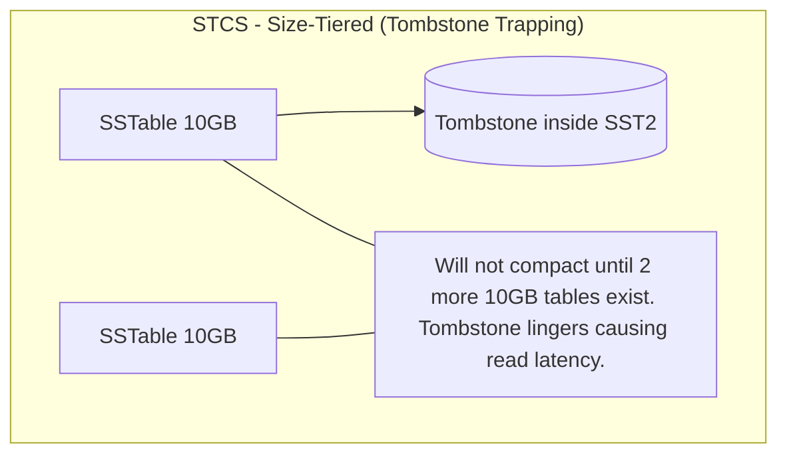

# Deep Dive: Cassandra Tombstones & Compaction Strategies

In a distributed, append-only storage system like Apache Cassandra, deleting data presents a unique challenge. Because SSTables are immutable, Cassandra cannot perform "in-place" physical deletions. Instead, it relies on a soft-delete mechanism known as Tombstones.

## 1. The Mechanics of Tombstones

When a client executes a `DELETE` operation, Cassandra writes a new record called a **Tombstone** over the existing value.

### Preventing Data Resurrection

Tombstones solve a critical distributed systems problem: **Zombie Data**.  

- If a node is down or unreachable during a delete operation, it misses the deletion request.  
- When the node comes back online, it still contains the old data. Without tombstones, this old data could be re-shared during anti-entropy repair, effectively resurrecting deleted records.  

**Solution:** By writing a Tombstone, Cassandra ensures all nodes in the cluster have a physical marker proving the data was intentionally deleted.

### `gc_grace_seconds`

- Each tombstone has an expiry time, configured via `gc_grace_seconds` (default: 10 days).  
- This delay ensures unavailable nodes have enough time to recover and synchronize the tombstone before the data is permanently purged.

## 2. The Read Performance Tax

While tombstones ensure consistency, they introduce **severe read performance degradation** before compaction occurs:

- **Wasted Storage Space:** A tombstone is a physical record. Deleting actually increases data size temporarily.  
- **Read Overhead:** During reads, Cassandra scans SSTables, processes tombstones, and filters deleted data. Large numbers of tombstones lead to high disk I/O and latency spikes.

## 3. Compaction Strategies

Compaction merges SSTables and permanently purges expired tombstones. The strategy chosen affects how efficiently tombstones are handled:

| Strategy | Mechanics | Workload Impact & Tombstone Handling |
|----------|----------|-------------------------------------|
| **Size-Tiered Compaction Strategy (STCS)** | Merges SSTables of similar sizes. Default strategy. | Write-heavy workloads. Poor for tombstones: tombstones can get trapped in older SSTables, lingering on disk and increasing read latency. |
| **Leveled Compaction Strategy (LCS)** | Groups SSTables into strictly sized levels (each level ~10x larger than previous). | Read-heavy workloads. Excellent for tombstones: aggressively compacts and removes deleted data. High I/O overhead, bad for write-heavy workloads. |
| **Time Window Compaction Strategy (TWCS)** | Compacts SSTables within strictly configured time windows. | Time-series / immutable data. Ideal for sensor logs. Once a time window closes, entire SSTables can be dropped cleanly if tombstones expire, avoiding read penalties. |

