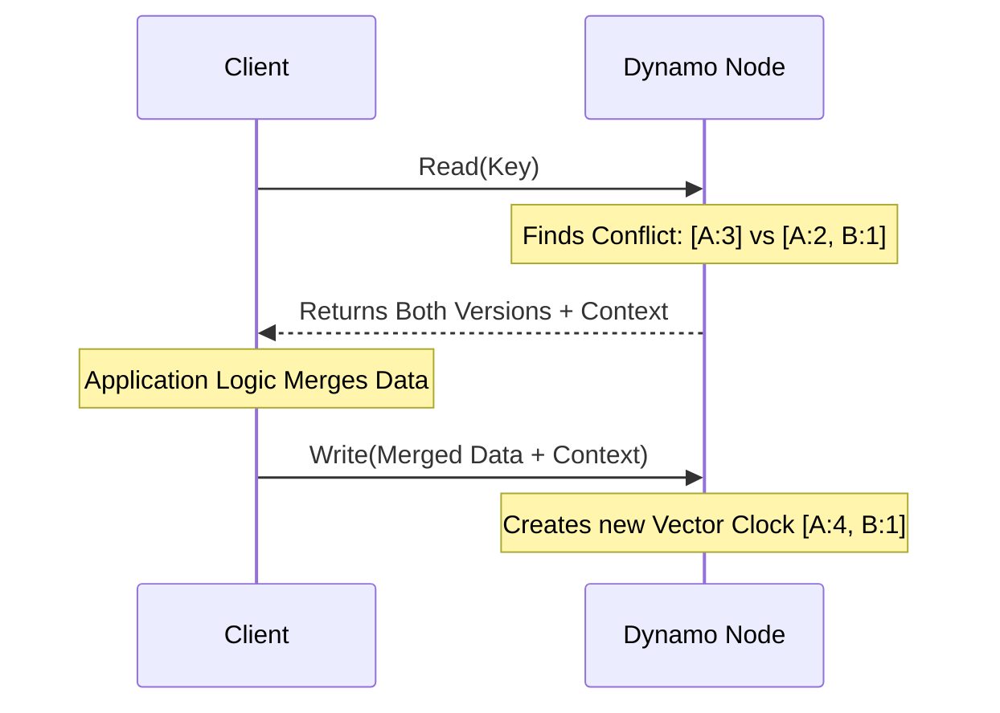

# Deep Dive: Conflict Resolution in NoSQL (Dynamo vs. Cassandra)

When distributed databases like **Amazon Dynamo** and **Apache Cassandra** prioritize **Availability** and **Partition Tolerance** (AP systems), they utilize **asynchronous replication** and **sloppy quorums**. This ensures the system remains "always writeable," but it introduces the risk of **concurrent updates** being written to different nodes. When these nodes reconnect or the data is queried, the system must resolve these conflicting versions.

---

## 1. Amazon Dynamo: Vector Clocks & Client Reconciliation

Dynamo tracks the **causality of updates** using **Vector Clocks**. A vector clock is a set of `[Node, Counter]` pairs associated with every version of an object.

### The Reconciliation Workflow

1.  **Conflict Detection:** When a client initiates a read, the coordinator retrieves multiple versions of the object. If the vector clocks are divergent (e.g., Version 1 is `[NodeA:3]` and Version 2 is `[NodeA:2, NodeB:1]`), the server cannot definitively determine which version is newer.
2.  **Delegation to the Client:** Because the database lacks application-level context to safely merge data (e.g., business logic for merging objects), it returns **all conflicting versions** to the client along with a `context` object.
3.  **Semantic Reconciliation:** The **client application resolves the conflict** using its specific business logic. For example, two divergent shopping carts are merged by taking the union of all items.
4.  **Write-Back:** The client writes the reconciled version back to the system. Dynamo then generates a **new vector clock** for the unified object, overriding the previous conflicting branches.

---

## 2. Apache Cassandra: Last-Write-Wins (LWW)

Cassandra simplifies conflict resolution by shifting the responsibility away from the client to the database itself using a **Last-Write-Wins (LWW)** policy.

### The Resolution Process

*   **Timestamp-Based Tracking:** Instead of vector clocks, Cassandra attaches a **physical timestamp** (microsecond precision) to every mutation (write or delete).
*   **Conflict Resolution Points:** Resolution occurs automatically during **Read Requests**, background **Read Repair**, and disk **Compaction**.
*   **Internal Resolution:** If multiple versions of a row or column exist, Cassandra compares the timestamps. The version with the **newest timestamp** is kept, and all older versions are discarded.

### The Edge Case: Data Loss Risk (NTP Clock Drift)

While LWW is extremely fast and simple, it is vulnerable to **NTP Clock Drift**. If distributed servers have unsynchronized physical clocks, a newer write might receive an older timestamp than an earlier write. In this scenario, Cassandra will discard the actual newest data, leading to **irreversible data loss**.

---

## Dynamo vs. Cassandra Comparison

| Feature | Amazon Dynamo | Apache Cassandra |
| :--- | :--- | :--- |
| **Tracking Mechanism** | Vector Clocks `[Node, Counter]` | Physical Timestamps |
| **Resolution Location** | Client-side (Application Logic) | Server-side (Internal DB Logic) |
| **Data Consistency** | Zero data loss (client merges data) | Risk of data loss (due to clock drift) |
| **Complexity** | High (requires complex client logic) | Low (fully automated and transparent) |
| **Use Case** | Critical state (e.g., Shopping Carts) | High-velocity logs or time-series data |
## 3. Practical Implementation

Explore low-level implementations of distributed consensus and conflict resolution:

* [System Design: NoSQL Internals](./NOSQL_INTERNALS.md)
* [System Design: Dynamo & Cassandra](../architectures/distributed_storage/DYNAMO_AND_CASSANDRA.md)
* [Machine Coding: Cache System](../../machine_coding/systems/cache/PROBLEM.md)
