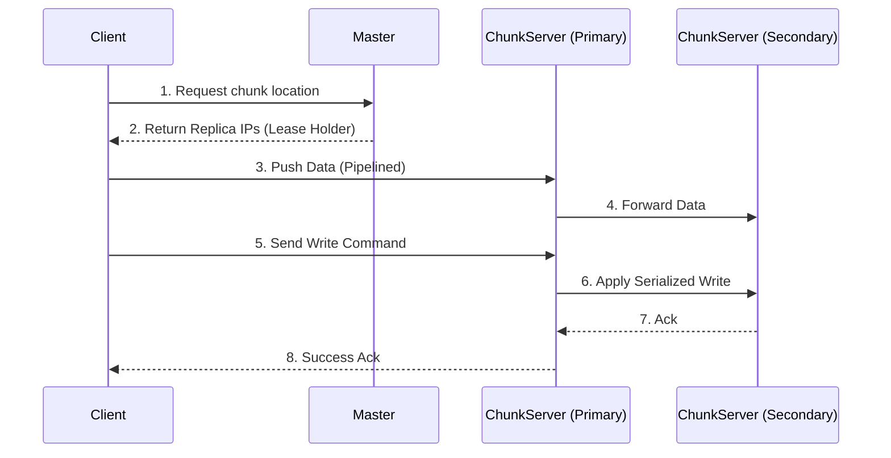

# Deep Dive: Google File System (GFS)

The Google File System (GFS) is a scalable distributed file system designed for large data-intensive applications. Built using inexpensive commodity hardware, it anticipates hardware failure as the norm and optimizes for massive files, sequential reads, and highly concurrent appends.

## 1. Architecture: Master and ChunkServers

GFS divides files into massive, fixed-size units called chunks.

**The 64 MB Chunk:** Unlike standard OS block sizes (4 KB), GFS uses a 64 MB chunk. This choice drastically reduces the size of metadata, allowing the Master node to keep the entire filesystem metadata in main memory (RAM) for ultra-fast lookups.

**The Master Node:** A single master maintains all metadata: namespaces, Access Control Lists (ACLs), file-to-chunk mappings, and current chunk locations.

**ChunkServers:** Store raw 64 MB chunks as standard Linux files. Each chunk is typically replicated across three different ChunkServers for fault tolerance.

## 2. Data Flow: Decoupling & Pipelining

To avoid the Master becoming a bottleneck, GFS strictly separates the control flow (metadata) from the data flow (raw bytes).

**Sequence of Operation**

1. **Metadata Request:** Client asks the Master for the location of a specific chunk.  
2. **Caching:** Client caches the metadata to minimize subsequent RPCs to the Master.  
3. **Linear Data Pipelining:** The client pushes data to the closest replica. That replica then forwards the data to the next, forming a linear chain. This maximizes network bandwidth utilization.

## 3. Mutations & Consistency

GFS differentiates between standard Writes (at a specific offset) and Record Appends. Record Appends are uniquely optimized for high-concurrency workloads.

**Record Append Atomicity & Padding**

In a Record Append, the client only sends the data; GFS dynamically chooses the offset, appends the data to the end of the file as one continuous sequence, and returns that offset to the client.

**Chunk Padding:** Because GFS relies on strict 64 MB chunk limits, the primary ChunkServer must evaluate if an incoming append will breach this physical limit. If the record exceeds the remaining chunk space, the primary pads the current chunk to its maximum 64 MB limit, commands all secondary replicas to perform the exact same padding, and instructs the client to retry the append operation on the next available chunk.

**The 'At-Least-Once' Guarantee & Data Duplication**

GFS explicitly sacrifices strict, byte-wise consistency across its replicas to prioritize high performance and availability, resulting in an 'At-Least-Once' delivery model.

- **No Rollbacks on Failure:** If an append operation fails at any replica (e.g., a secondary ChunkServer crashes or drops a network packet), the primary reports a failure to the client. GFS does not roll back the data that was already successfully written to the primary or the healthy secondaries.  
- **Data Duplication:** When the client retries the failed append, the primary processes it as a new request, assigning it a new offset. Replicas of the same chunk may contain different data, including duplicated records or fragments.  

**Client-Side Deduplication**

GFS guarantees that data will eventually be written at least once as a fully atomic, contiguous unit. The reading client is responsible for deduplication using mechanisms like sequence numbers and checksums.

## 4. Fault Tolerance & Integrity

- **Chubby Integration:** GFS uses Chubby for Master election and to ensure there is only one active Master at any time.  
- **Checksumming:** Each ChunkServer maintains checksums for every 64 KB block to detect corruption or "bit rot."  
- **Garbage Collection:** Lazy Deletion strategy: deleted files are renamed and permanently purged only after a multi-day retention period, allowing recovery of accidental deletions.

## 5. Comparison: GFS vs. HDFS

| Feature | Google File System (GFS) | Hadoop Distributed File System (HDFS) |
|---------|--------------------------|--------------------------------------|
| Primary Unit | Chunk (64 MB) | Block (128 MB default) |
| Master Node | Master | NameNode |
| Data Node | ChunkServer | DataNode |
| Consistency | At-least-once (Appends) | Strict consistency (Write-once) |
| Locking | Chubby | ZooKeeper |
| Write Model | Multiple writers (Appends) | Single writer (Append-only) |
## 6. Practical Implementation

Explore low-level implementations of distributed file systems and append-only logs:

* [System Design: Kafka & HDFS Deep Dive](./KAFKA_DEEP_DIVE.md)
* [System Design: NoSQL Internals](./NOSQL_INTERNALS.md)
* [Machine Coding: Kafka Lite](../../machine_coding/distributed/pub_sub/PROBLEM.md)
