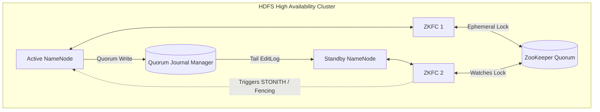

# Deep Dive: HDFS High Availability & Fencing

To eliminate the Single Point of Failure (SPOF) inherent in the original Hadoop architecture, modern HDFS utilizes an Active-Standby NameNode configuration. This requires sophisticated distributed coordination to prevent data corruption during failovers.

## 1. Quorum Journal Manager (QJM) Architecture

To keep the Standby NameNode perfectly synchronized with the Active NameNode, HDFS relies on a highly available shared storage mechanism called the QJM.

- **Journal Nodes:** The QJM operates as a group of independent daemons (typically 3 nodes to tolerate 1 failure).
- **Quorum Writes:** The Active NameNode writes all EditLog mutations to the QJM. An edit is only considered successful if it is written to a quorum (majority) of the journal nodes via RPC.
- **State Synchronization:** The Standby NameNode constantly tails this shared EditLog, applying the mutations to its own in-memory block mapping. If the Active NameNode dies, the Standby is fully prepared to take over instantly.

## 2. ZKFailoverController (ZKFC)

The ZKFC is a lightweight ZooKeeper client process running on every NameNode machine. It serves as the bridge between HDFS and ZooKeeper.

- It continuously pings the local NameNode for health checks.
- It maintains an ephemeral lock (znode) in ZooKeeper. If the Active NameNode's ZKFC loses its connection to ZooKeeper, the lock is released, and the Standby ZKFC detects the drop and triggers an automatic failover.

## 3. Split-Brain and Fencing (STONITH)

During a severe network partition, the Active NameNode might be cut off from ZooKeeper but still be fully operational, falsely believing it is the leader. If the Standby NameNode is promoted, two NameNodes will issue conflicting commands to DataNodes, causing catastrophic corruption (Split-Brain).

### Fencing Mechanisms

To neutralize this threat, HDFS puts a literal "fence" around the rogue NameNode before promoting the Standby.

- **Resource Fencing:** Blocks the rogue NameNode from accessing essential resources. For example, executing a vendor-specific NFS command to revoke the rogue node's access to the shared storage directory, or remotely disabling its network switch port.
- **Node Fencing (STONITH):** A brute-force approach standing for "Shoot The Other Node In The Head". If resource fencing fails, the system executes a remote management command (e.g., via IPMI or ILO) to physically power off or hard-reset the previously Active NameNode hardware, ensuring with absolute certainty it cannot communicate with the cluster.

