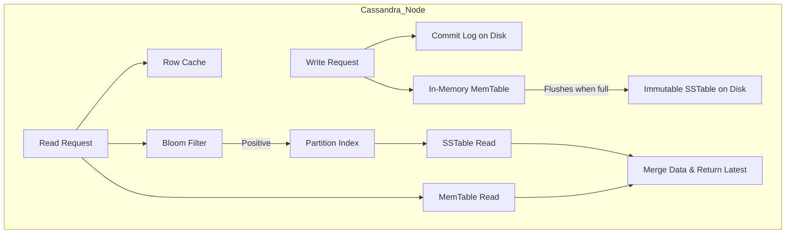

# Deep Dive: NoSQL Database Internals

This document compares the **internal read and write paths** of three foundational NoSQL architectures: **Dynamo**, **Cassandra**, and **BigTable**.

---

## 1. Amazon Dynamo (Key–Value)

Dynamo is a **highly available, decentralized datastore** that prioritizes **"always writeable" mechanics**.

### Write Path

1. The **coordinator node** generates a new data version and a **Vector Clock `[Node, Counter]`** to track causality.
2. The request is sent to **N−1 healthy nodes**, aiming for a **Sloppy Quorum**.

**Hinted Handoff**

- If a target node is down, a **healthy node temporarily buffers the write locally**.
- Once the failed node recovers, the buffered write is delivered.

### Read Path

1. The **coordinator** requests data from **N−1 nodes**.
2. It waits for **R−1 replies**.

**Conflict Handling**

- If **Vector Clocks indicate concurrent updates**, Dynamo returns **all versions to the client**.
- The **client performs semantic reconciliation**.

### Anti-Entropy

Background synchronization occurs using **Merkle Trees**.

- A **Merkle Tree** is a binary tree of hashes.
- It allows replicas to **quickly detect divergence**.
- Only the **inconsistent data ranges are synchronized**, minimizing network transfer.

---

## 2. Apache Cassandra (Wide-Column)

Cassandra combines:

- **Dynamo’s decentralized cluster architecture**
- **LSM-Tree storage engine**

### Architecture Overview

### Write Path

1. The **coordinator forwards the write** to replicas based on the configured **consistency level**.
2. If a replica node is unavailable, **Hinted Handoff** may temporarily store the write on another node.
3. The write is **immediately appended to the Commit Log** (disk-based) to guarantee **crash recovery durability**.
4. The data is written to an **in-memory MemTable**.
5. When the MemTable reaches a threshold, it is **flushed to disk as an immutable SSTable**.

---

### Read Path

1. The system first checks the **Row Cache** (in-memory).
2. If the data is not found, **Bloom Filters** are used to probabilistically determine which **SSTables might contain the data**.
3. This avoids **unnecessary disk seeks**.
4. The system reads data from:
   - **MemTable**
   - **Relevant SSTables**
5. The results are **merged to return the most recent value**.

---

### Read Repair

- The coordinator **hashes responses from multiple replicas**.
- If mismatches are detected, the coordinator **updates the out-of-sync replicas**.
- This ensures **eventual consistency across nodes**.
## 3. Practical Implementation

Explore the low-level implementations of LSM-Trees and distributed storage internals:

* [System Design: Dynamo & Cassandra](../architectures/distributed_storage/DYNAMO_AND_CASSANDRA.md)
* [System Design: Conflict Resolution](./CONFLICT_RESOLUTION.md)
* [Machine Coding: Cache System](../../machine_coding/systems/cache/PROBLEM.md)
