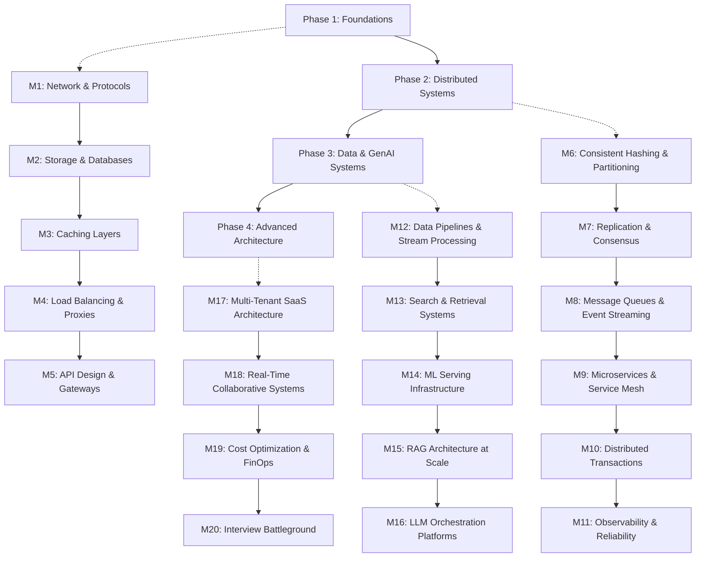

# 🎓 System Design Mastery Program
### Target Audience: Senior & Staff Engineers

---

> This program is structured in **4 phases, 20 modules**. Each module follows the same narrative format as the Factory Method example — an engineering story with a villain, hero, plot, and twist. Modules progress from foundational systems to GenAI-specific architecture.

---

## 📋 Program Overview

| Phase | Focus | Duration | Modules |
|-------|-------|----------|---------|
| **Phase 1** | Foundations & Building Blocks | 3 weeks | 1–5 |
| **Phase 2** | Core Distributed Systems | 4 weeks | 6–11 |
| **Phase 3** | Data-Intensive & GenAI Systems | 4 weeks | 12–16 |
| **Phase 4** | Advanced Architecture & Interview Prep | 3 weeks | 17–20 |

---

## 🗺️ Learning Path

