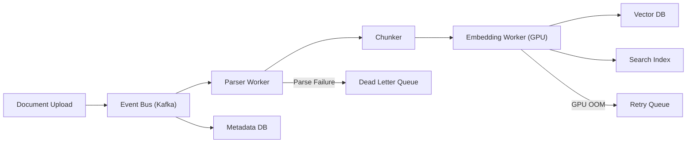

# Module 12: Data Pipelines & Stream Processing

### 🚀 Problem Statement
An organization might upload 500 compliance documents per day. Each must be: parsed (PDF/DOCX), chunked (semantic splitting), embedded, indexed in a vector DB, and made searchable — ideally within 5 minutes of upload. If a batch job runs only every 6 hours, significant delays occur.

### 🧠 The Engineering Story

**The Villain:** "The Nightly Batch." Documents uploaded at 9 AM might not be searchable until 3 PM. An end user cannot find updated data records because the pipeline hasn't run yet.

**The Hero:** "The Streaming Ingestion." Each document upload triggers a real-time pipeline: parse → chunk → embed → index. Documents are searchable within minutes, not hours.

**The Plot:**

1. Design a streaming pipeline: source (upload event) → transform (chunk + embed) → sink (vector DB + search index)
2. Handle backpressure: what happens when GPU embedding is slower than document uploads
3. Implement exactly-once processing with checkpointing
4. Design a dead-letter queue for documents that fail processing

**The Twist (Failure):** **The Ordering Problem.** A user uploads v1.0, then immediately uploads v1.1. If the streaming pipeline processes v1.1 first (e.g., because it is a smaller file), v1.0 might subsequently overwrite it, causing the latest version to be lost.

**Interview Signal:** Can design a pipeline that handles ordering, backpressure, and failure recovery.

### 🧠 Pipeline Architecture

### 🔗 Case Study References
- [Dockerized Job Scheduler](../../../infrastructure_challenges/dockerized_job_scheduler/PROBLEM.md) — Real-world implementation of async background processing.
