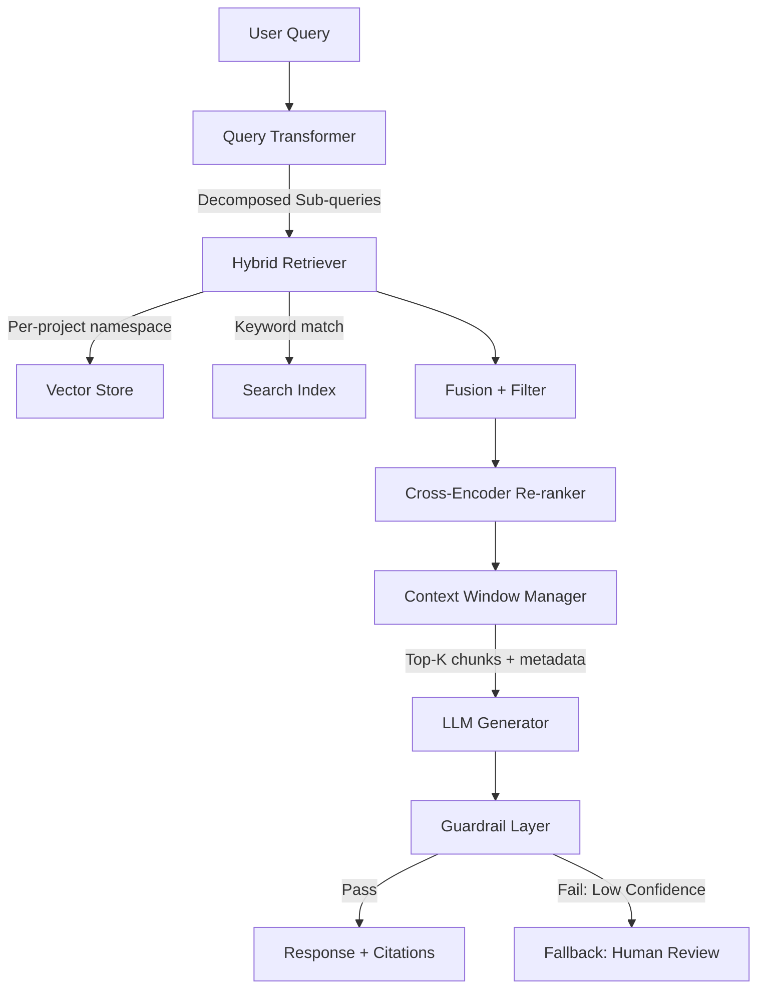

# Module 15: RAG Architecture at Scale

### 🚀 Problem Statement
A RAG system that works well with 100 documents might struggle in production with 500K documents across 200 projects. Issues can include hallucinating project-specific details, failing to distinguish between similarly named tasks across different instances, and retrieving irrelevant chunks from unrelated projects.

### 🧠 The Engineering Story

**The Villain:** "The Naive Retriever." If all 500K documents are placed in a single vector store, a query about "Task 3 system risks" might retrieve similar-sounding tasks from 15 different projects. The LLM could then conflate them into an incorrect answer.

**The Hero:** "The Structured RAG Pipeline." Multi-tenancy in retrieval, hierarchical chunking, context-aware prompting, and faithfulness guardrails.

**The Plot:**

1. **Chunking strategy:** Semantic chunking with parent-child relationships (retrieve child, expand to parent for context)
2. **Multi-tenant retrieval:** Namespace isolation — each project/document has its own vector partition
3. **Query transformation:** Decompose complex queries, generate hypothetical documents (HyDE)
4. **Faithfulness guardrails:** Cite sources, detect hallucination, flag low-confidence answers

**The Twist (Failure):** **The Context Window Overflow.** If the retrieval step returns 20 highly relevant chunks (e.g., 8K tokens each) and all 160K tokens are stuffed into the prompt, the LLM might ignore middle chunks — a "Lost in the Middle" phenomenon — and answer using only the beginning and end of the provided context.

**Interview Signal:** Can design a production RAG system with data isolation, quality guardrails, and chunking strategy.

### 🧠 Production RAG Architecture

### 🔗 Case Study References
- [WhatsApp Architecture](../../architectures/social_media/WHATSAPP.md) — For real-time delivery and notification patterns at scale.
