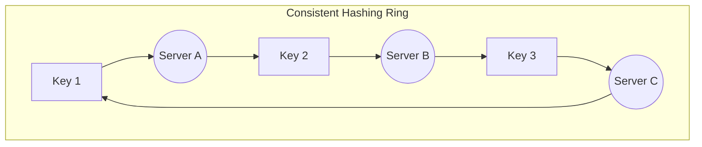
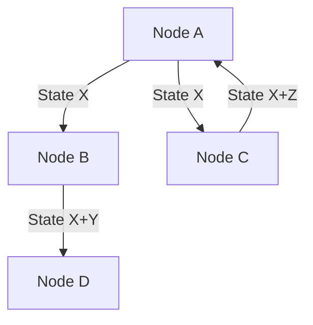

# Architecture Patterns in Distributed Systems

This document synthesizes the core architectural patterns utilized by modern distributed systems to solve challenges regarding state management, fault tolerance, and data distribution.

## 1. Consistent Hashing
In dynamic distributed caching systems, simply using `hash(key) % n` is inefficient because adding or removing a server causes nearly all keys to be remapped, leading to massive cache misses.
**Consistent Hashing** solves this by mapping both data (keys) and servers (nodes) to a fixed circular ring (e.g., $0$ to $2^{32} - 1$).

### Key Concepts
* **Mechanism:** The hash function maps both keys and servers to a fixed circular space (the ring). A key is stored on the first server found moving clockwise on the ring.
* **Scaling:** When a server is added, it only takes a portion of keys from its neighbor. When removed, its keys are redistributed to its neighbor, minimizing data movement.
* **Virtual Nodes (VNodes):** To prevent "hotspots" (uneven data distribution) and handle heterogeneous server capacities, each physical server is mapped to multiple points on the ring using virtual replicas. This ensures more uniform distribution.

## 2. Write-Ahead Logging (WAL)
WAL is a standard method for ensuring data integrity and durability. To guarantee that committed transactions are not lost, each modification to the system is first written to an append-only log on stable storage before it is applied to the in-memory data structures.

| Feature | Description |
| :--- | :--- |
| **Durability** | Guarantees that committed transactions are not lost. |
| **Atomicity** | Helps in rolling back uncommitted changes. |
| **Performance** | Sequential writes to the log are faster than random writes to data files. |

* **Recovery:** In the event of a crash, the system can replay the WAL to restore the database to a consistent state.
* **Performance:** Appending to a log file is a sequential I/O operation, which is significantly faster than random writes to database tables.

## 3. Bloom Filters
A **Bloom Filter** is a space-efficient probabilistic data structure used to test whether an element is a member of a set. It is widely used to reduce expensive disk I/O operations.

### Properties
* **False Positive:** Might say "Yes" when the element is *not* in the set (requires a disk check to confirm).
* **False Negative:** Never says "No" if the element *is* in the set (authoritative "No").

### Workflow
1.  **Query**: "Is Key X in SSTable Y?"
2.  **Response**: "Possibly" (Check disk) or "No" (Skip disk).

**Use Case:** LSM-tree based databases like Cassandra and HBase use Bloom Filters to quickly check if an SSTable contains a specific row key before executing an expensive disk seek.

## 4. Quorums & Consensus
Quorum ensures consistency in distributed systems by requiring a minimum number of votes for an operation to be considered successful.

### Formula
For strong consistency (read overlap with write), the condition is:
$$R + W > N$$

* **N (Total Replicas):** The total number of nodes storing the data.
* **R (Read Quorum):** Minimum nodes that must agree on a read.
* **W (Write Quorum):** Minimum nodes that must acknowledge a write.

**Example Configuration:** Typically $N=3, W=2, R=2$. This allows the system to tolerate 1 node failure while maintaining strong consistency.

## 5. Gossip Protocol
A decentralized, peer-to-peer communication protocol where nodes periodically exchange state information with random peers. It is used for failure detection and cluster membership management without a central coordinator.

* **Mechanism:** A node picks a random subset of other nodes and shares its information. This information propagates epidemically (like a virus) through the cluster, achieving eventual consistency of the cluster state.
* **Use Cases:** Dynamo and Cassandra use Gossip to detect node failures, share heartbeat data, and manage ring membership.

## 6. Merkle Tree (Anti-Entropy)
To repair stale data in the background (Read Repair/Anti-Entropy), systems need to efficiently compare replicas without sending entire datasets over the network.

* **Mechanism:** A Merkle Tree is a binary tree of hashes where each internal node is the hash of its two children, and leaf nodes are hashes of the actual data blocks.
* **Comparison:** Nodes compare the root hash. If they differ, they traverse down the tree branches to find the specific data blocks that are out of sync, transferring only the differing data.
