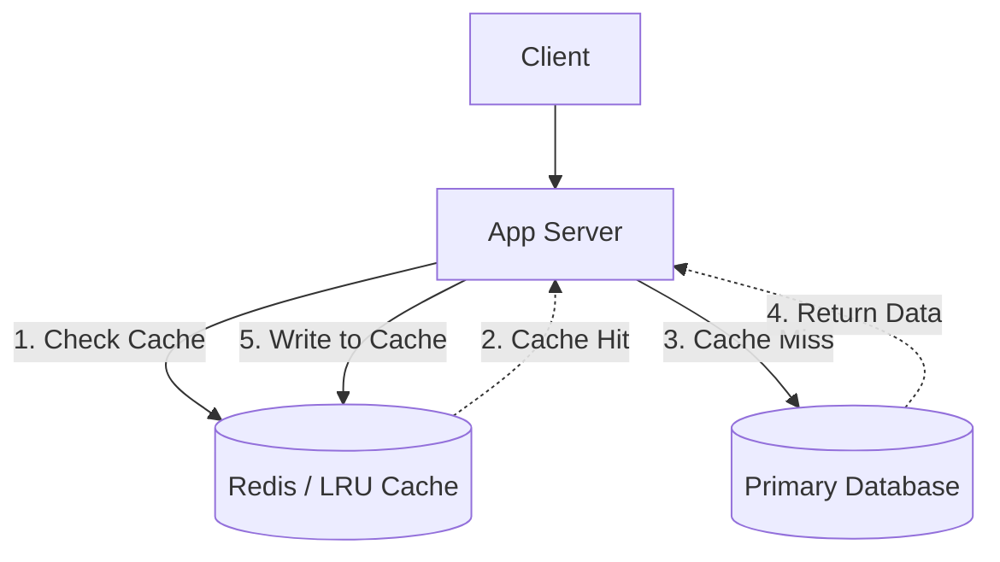

# System Architecture: Caching Strategies

Caching leverages the locality of reference principle: recently requested data is likely to be requested again. By storing this data in a faster, transient storage layer (like RAM), future requests are served much faster than querying the primary database.

---

## 1. Caching Tiers

Caches can be implemented at multiple levels in a distributed architecture to minimize latency:

- **Client/Browser Cache**: Stores static assets (HTML, CSS, JS, images) on the user's device.
- **CDN (Content Delivery Network)**: Edge servers cache static media near the user, reducing latency for large files (e.g., Instagram photos, YouTube videos).
- **Application/In-Memory Cache**: Systems like **Redis** or **Memcached** store frequently accessed database queries or computed objects (e.g., User Timelines) between the Application and Database tiers.
- **Database Cache**: Modern databases (like PostgreSQL/MySQL) use buffer pools to cache frequently read disk pages in memory.

---

## 2. Cache Invalidation & Writing Strategies

When data in the database changes, cached versions must be managed to avoid stale results.

### A. Cache-Aside (Lazy Loading)
- **Mechanism**: The application code explicitly checks the cache. On a "miss," it queries the database, returns the data, and stores it in the cache for future use.
- **Pros**: Only requested data is cached; cache failure is not catastrophic (system falls back to DB).
- **Cons**: Initial read is slower (three-step process).

### B. Read-Through / Write-Through
- **Mechanism**: The application treats the cache as the primary data store. The cache itself is responsible for reading from/writing to the database.
- **Pros**: Simplifies application logic; ensures cache and DB are always in sync (consistency).
- **Cons**: Higher write latency as both must succeed.

### C. Write-Around
- **Mechanism**: Data is written directly to the database, bypassing the cache.
- **Pros**: Prevents the cache from being flooded with data that isn't read frequently.
- **Cons**: A subsequent read will result in a cache miss.

### D. Write-Back (Write-Behind)
- **Mechanism**: Data is written only to the cache. The cache then flushes updates to the database asynchronously.
- **Pros**: Extremely fast write performance; ideal for write-heavy systems.
- **Cons**: Risk of data loss if the cache crashes before the data is persisted to the DB.

---

## 3. Cache Eviction Policies

When the cache is full, eviction policies determine which items are removed:

| Policy | Mechanism | Best Use Case |
| :--- | :--- | :--- |
| **LRU (Least Recently Used)** | Removes items not accessed for the longest time | General purpose; User sessions, timelines |
| **LFU (Least Frequently Used)** | Removes items with the lowest access count | Static lookup tables with permanently popular items |
| **FIFO (First In, First Out)** | Removes items in the order they were added | Chronological buffers or time-series data |
| **MRU (Most Recently Used)** | Removes the most recently accessed items | Scans where old data is more likely to be re-read |

---

## 4. Visualizing the Cache-Aside Flow

---

## 5. Practical Implementation

Explore low-level implementations and related challenges:

- **Distributed Caching (Redis)**: [Infrastructure: Redis Rate Limiter](../../infrastructure_challenges/redis_rate_limiter/PROBLEM.md)
- **System Design Implementation**: [Machine Coding: Cache System](../../machine_coding/systems/cache/PROBLEM.md)
- **DSA Algorithm**: [LeetCode: LRU Cache Implementation](../../dsa/06_linked_list/lru_cache/PROBLEM.md)
