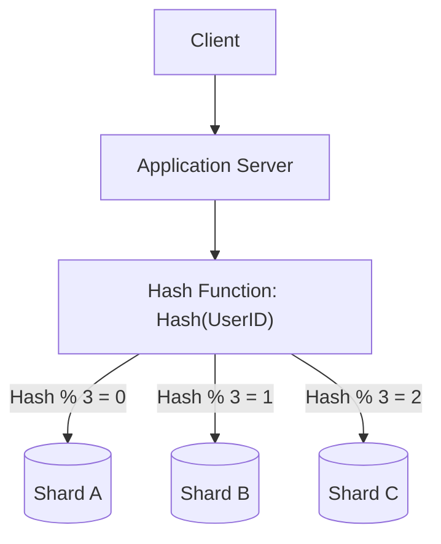
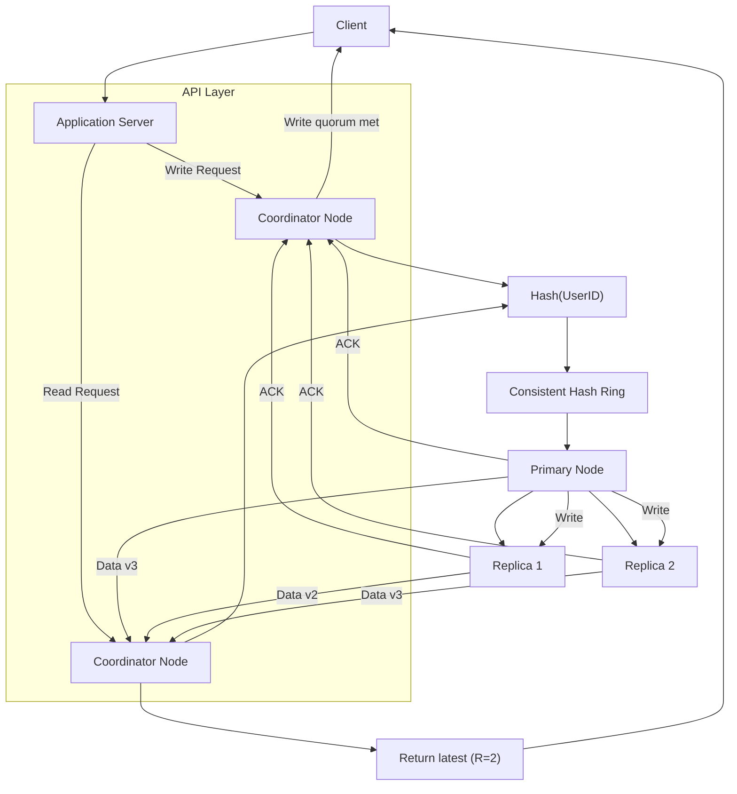

# System Architecture: Data Partitioning (Sharding)

As databases scale beyond the storage or compute capacity of a single machine, data must be broken into smaller, manageable chunks called **partitions** or **shards**. Sharding is a core component in distributed systems that enables horizontal scaling and improves performance.

---

## 1. Partitioning Methods

Depending on the application's needs, data can be partitioned in different ways:

### Vertical Partitioning
- **Mechanism:** Dividing data by tables or columns based on features. For example, in a social media app, user profile information might be stored on one server while photo metadata is on another.
- **Pros:** Simple to implement and maintain initially.
- **Cons:** Limited scalability; if a single feature grows exponentially (e.g., billions of photos), that specific partition will eventually require horizontal sharding.

### Horizontal Partitioning (Sharding)
- **Mechanism:** Splitting rows of a table across multiple servers based on a **partition key**. For example, Server A holds User IDs 1-1M, and Server B holds User IDs 1M-2M.
- **Pros:** Practically unlimited horizontal scalability.
- **Cons:** Increases complexity in queries and referential integrity.

---

## 2. Sharding Criteria & Routing

How the system maps a specific piece of data to a shard determines the performance and balance of the cluster.

| Criteria | Mechanism | Drawbacks |
| :--- | :--- | :--- |
| **Range-Based** | Assign data based on value ranges (e.g., ZIP codes 10000-20000 -> Shard 1). | Can create "hotspots" if traffic is concentrated in a specific range. |
| **Hash-Based** | Apply a hash function to the key (`hash(key) % n`) to determine the shard. | Adding/removing servers requires massive data migration ("Modulo Fallacy"). |
| **Consistent Hashing** | Decouples keys from the absolute number of nodes using a hash ring. | Solves the data migration problem (see [Architecture Patterns](./ARCHITECTURE_PATTERNS.md#1-consistent-hashing)). |
| **Directory-Based** | Use a central lookup service that maps keys to exact shard locations. | The lookup service is a potential Single Point of Failure (SPOF) and latency bottleneck. |

---

## 3. Common Challenges & Distributed Constraints

While sharding solves storage limits, it introduces significant operational and technical complexities:

### Joins and Denormalization
- **Problem:** SQL JOINs across shards are extremely slow and complex to execute.
- **Solution:** Denormalize data by duplicating required fields so reads can be satisfied from a single shard.

### Referential Integrity
- **Problem:** Database-level foreign keys and constraints cannot span physical servers.
- **Solution:** Enforce referential integrity at the **application layer** instead of relying on the database engine.

### The Hot Spot Problem (Hot Users)
- **Problem:** Uneven traffic distribution (e.g., a celebrity generating millions of hits on one shard) creates bottlenecks.
- **Solution:** Use **Consistent Hashing with Virtual Nodes** to distribute load and split overloaded shards dynamically.

### Rebalancing
- **Problem:** Over time, data distribution can become skewed. Rebalancing (moving data to new shards) without downtime is mathematically and operationally challenging.

---

## 4. Visualizing Hash-Based Sharding

---

Perfect — here’s a **ready-to-present interview cheat sheet**: the **diagram + small talking bullets next to each part**. You can literally use this on a whiteboard or slide and narrate it fluently.

---

## 🚀 Consistent Hashing + Quorum System (Cheat Sheet)

---

### 🔹 Notes (for each part)

| Diagram Part            | Talking Point                                                                           |
| ----------------------- | --------------------------------------------------------------------------------------- |
| **Client → API**        | Entry point for requests. Handles client communication.                                 |
| **Coordinator Node**    | Determines responsible shards based on hash. Handles ACK collection.                    |
| **Hash → Ring**         | Consistent hashing ensures minimal data movement on node changes.                       |
| **Primary + Replicas**  | Each key is written to a primary + replicas. Provides durability and fault tolerance.   |
| **Write Path & Quorum** | W=2 → coordinator waits for 2 ACKs before responding. Ensures strong consistency.       |
| **Read Path & Quorum**  | R=2 → coordinator queries multiple nodes, returns latest version. Resolves stale reads. |
| **Result Node**         | Represents final data returned to the client.                                           |
| **Replication**         | Arrows from primary → replicas show replication flow.                                   |
| **Failure Handling**    | Any node failure is automatically handled via replicas. Minimal disruption.             |

---

### 💡 Delivery Tips

1. Start with **write flow** → explain **quorum and replication**.
2. Then show **read flow** → explain **latest data & R quorum**.
3. Emphasize **R+W>N** for consistency.
4. Highlight **hash ring → shards → replicas** as the key design pattern.
5. Optional: mention **vnodes, hinted handoff, read repair** if asked.

---

## 5. Practical Implementation

Explore deep dives and practical applications of these partitioning concepts:

- **Mastery Program:** [Module 6: Consistent Hashing & Partitioning](../mastery_program/phase_2/m6_partitioning.md)
- **Architectural Deep Dive:** [Distributed KV Store (Consistent Hashing)](../architectures/distributed_storage/KV_STORE.md)
- **Architecture Patterns:** [Consistent Hashing Deep Dive](./ARCHITECTURE_PATTERNS.md#1-consistent-hashing)
