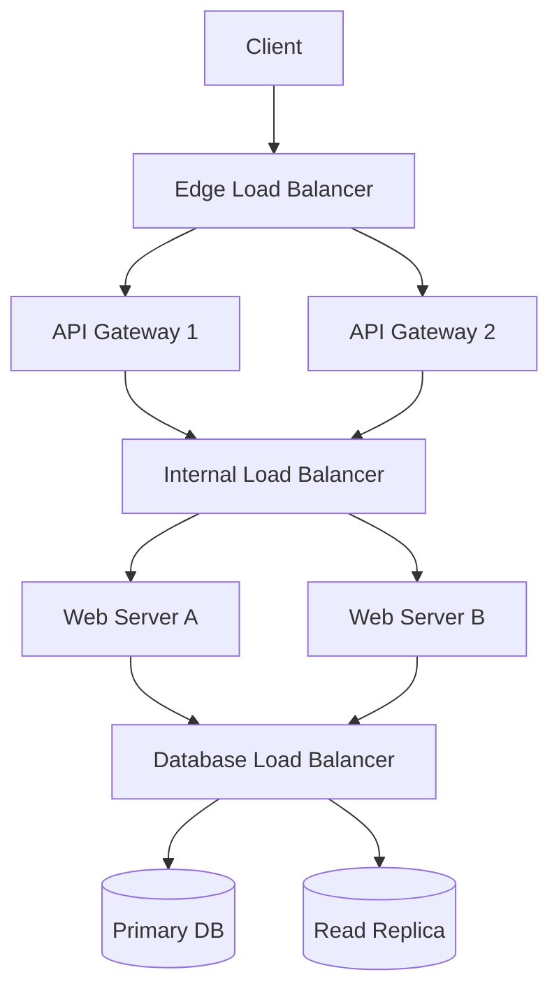

# System Architecture: Load Balancing

Load Balancers (LBs) are a critical component of any distributed system. They distribute incoming client requests or network traffic efficiently across multiple servers, ensuring that no single server bears too much demand.

---

## 1. Core Functions of a Load Balancer

By balancing application requests across multiple servers, a load balancer reduces individual server load and prevents any one application server from becoming a single point of failure (SPOF).

- **Health Checking**: LBs continuously monitor the "health" of backend servers (usually via a `/health` HTTP endpoint). If a server fails a health check, the LB automatically removes it from the pool and reroutes traffic to healthy servers.
- **SSL Termination**: LBs often handle the decryption of incoming HTTPS traffic, relieving backend servers of SSL/TLS overhead.
- **Session Persistence (Sticky Sessions)**: Routes a specific client to the same backend server using a cookie, if continuous session access is required.
    - *Note:* This is often considered an anti-pattern in modern stateless microservices architectures.

---

## 2. Placement of Load Balancers

In massive-scale architectures, LBs are deployed at multiple layers to ensure redundancy and low-latency routing.

---

## 3. Load Balancing Algorithms

| Algorithm | Mechanism | Best Use Case |
| :--- | :--- | :--- |
| **Round Robin** | Cycles through servers in order (A -> B -> C -> A) | Equal hardware servers with similar request costs |
| **Weighted Round Robin** | Assigns more requests to servers with higher weight | Heterogeneous clusters (some servers faster than others) |
| **Least Connections** | Routes to server with fewest active connections | Varying request durations (e.g., long WebSockets) |
| **IP Hash** | Hashes client IP to determine server | Ensures sticky sessions for a specific user |
| **Consistent Hashing** | Distributes requests based on hash ring topology | Distributed Caching & storage (see [Architecture Patterns](./ARCHITECTURE_PATTERNS.md#1-consistent-hashing)) |

---

## 4. Redundancy: Active-Passive vs. Active-Active

To ensure the Load Balancer itself is not a single point of failure:

- **Active-Passive**: One LB handles all traffic while the secondary (passive) LB monitors the primary. If the active LB fails, the passive one takes over immediately.
- **Active-Active**: Both LBs route traffic simultaneously, doubling throughput. This requires multiple public IPs or DNS-based load balancing (Global Server Load Balancing).

---

## 5. Practical Implementation

Explore the implementation of proxying, routing, and distribution logic in the repository:

- **Rate Limiting & Proxying**: [Infrastructure Challenges: Redis Rate Limiter](../../infrastructure_challenges/redis_rate_limiter/PROBLEM.md)
- **Job Scheduling & Worker Distribution**: [Infrastructure Challenges: Dockerized Job Scheduler](../../infrastructure_challenges/dockerized_job_scheduler/PROBLEM.md)
