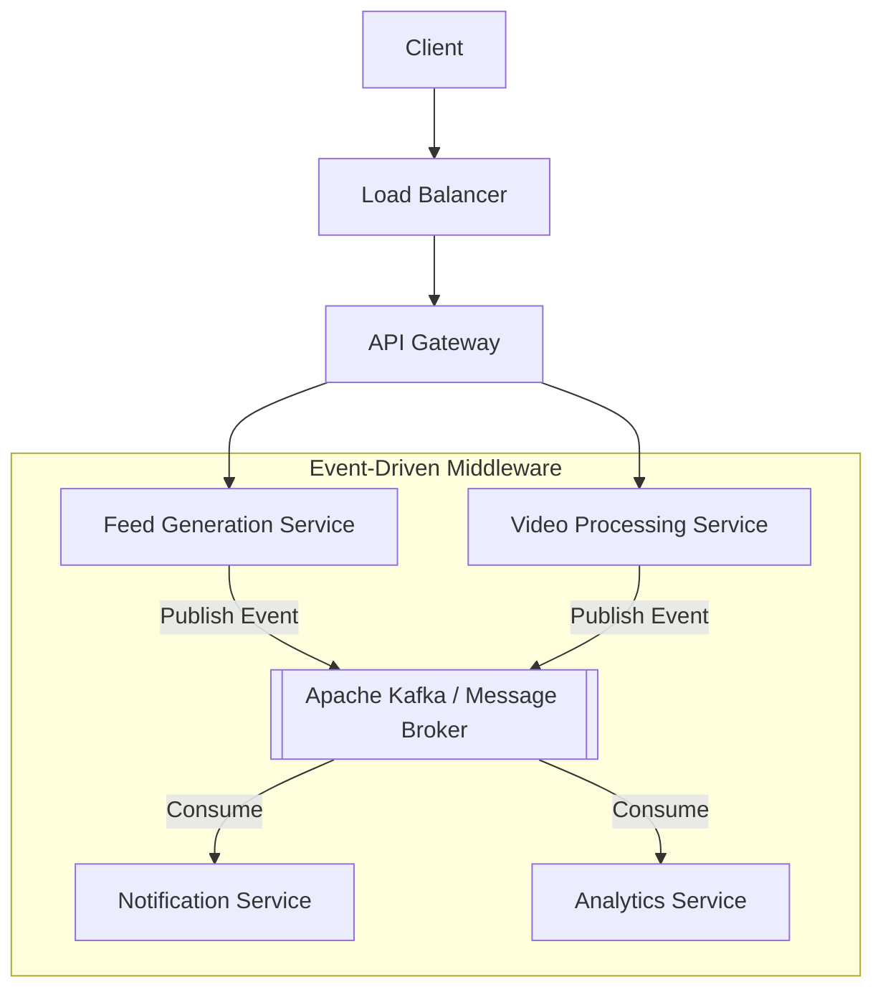

# System Architecture: API Gateway & Messaging Systems

As systems evolve into a multitude of micro-components, the architecture must implement robust routing and asynchronous decoupling to prevent cascading failures and ensure independent scalability.

---

## 1. The API Gateway

In a microservices architecture, exposing dozens of internal service IPs directly to the client is a security and operational anti-pattern. The **API Gateway** acts as the singular, unified entry point for all incoming client traffic. It typically sits immediately behind the Load Balancer.

### Key Responsibilities
*   **Request Routing:** Maps incoming HTTP requests to the correct internal micro-component (e.g., routing `/api/feed` to the Feed Service and `/api/video` to the Video Service).
*   **Cross-Cutting Concerns:** Centralizes logic that would otherwise be duplicated across every service:
    *   **Authentication / JWT Validation:** Ensuring only authorized requests reach the backend.
    *   **Rate Limiting:** Protecting services from thundering herds or abuse (see [API Rate Limiter](../../architectures/utilities/RATE_LIMITER.md)).
    *   **SSL Termination:** Handling HTTPS decryption at the edge.
    *   **Telemetry:** Centralized logging, metrics collection, and request tracing.
*   **Protocol Translation:** Translating between external-facing protocols (like REST/HTTP) and internal communication protocols (like gRPC or Protobuf).

---

## 2. Asynchronous Messaging Systems

Synchronous HTTP calls between microservices create **tight coupling**. If Service A calls Service B and Service B is slow or down, Service A will hang, exhaust its thread pool, and eventually crash (cascading failure).

To solve this, architectures introduce **Messaging Systems** (like **Apache Kafka** or **RabbitMQ**) as communication middleware to enable an event-driven model.

### Asynchronous Publish-Subscribe
*   **Producer:** A service (e.g., Feed Generation) performs an action and publishes a lightweight event (e.g., `FeedUpdated{UserID: 123}`) to the message broker. It then immediately returns success to the user without waiting for downstream processing.
*   **Message Broker:** Durably stores the event in a "Topic" or "Queue."
*   **Consumer:** Downstream services (e.g., Notifications, Analytics) independently poll the broker, pick up the event, and process it at their own pace.

---

## 3. Benefits of Event-Driven Decoupling

*   **Independent Scaling:** You can spin up more consumers to handle a backlog of events without needing to scale the producers.
*   **Fault Isolation:** if a consumer service goes offline, events simply queue up in the broker. The system continues to function, and the consumer catches up once it is back online.
*   **Traffic Smoothing (Buffering):** During viral events, the broker acts as a shock absorber, storing millions of events safely while backend workers process them at a sustainable rate.

---

## 4. Visualizing the Architecture

---

## 5. Practical Implementation

Explore the implementation of message brokers and related architectural patterns:

*   **Message Broker (Kafka Lite):** [Machine Coding: Kafka Lite](../../../machine_coding/distributed/pub_sub/PROBLEM.md)
*   **Rate Limiting (Gateway Concern):** [System Design: API Rate Limiter](../../architectures/utilities/RATE_LIMITER.md)
*   **Real-time Messaging (Pub/Sub):** [System Design: WhatsApp Lite](../../architectures/social_media/WHATSAPP.md)
