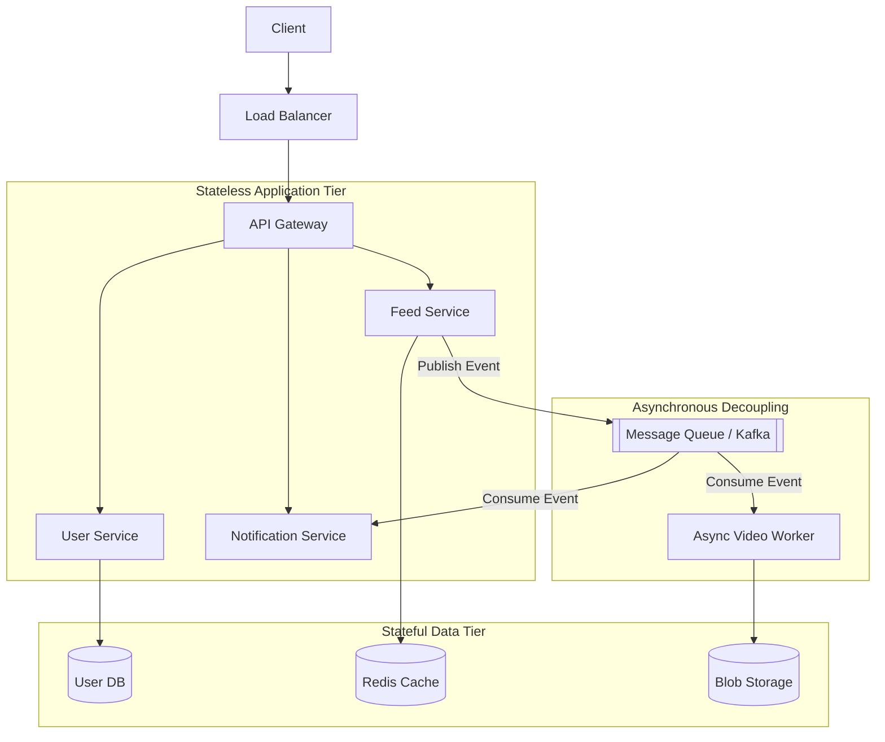

# System Architecture: Decoupling & Micro-components

As systems scale to handle millions of users, the fundamental architecture must evolve from a single unified codebase into highly specialized, decoupled micro-components. This document outlines the architectural patterns used to separate concerns and guarantee independent scalability.

---

## 1. The Evolution of System Architecture

### The Monolithic Anti-Pattern at Scale
Initially, a system might be designed as a single application running on a single server, encompassing the web server, application logic, and database. As traffic grows, this tightly coupled architecture becomes a severe bottleneck: a spike in read queries will consume all CPU resources, starving the application logic of compute power and causing the entire system to crash.

### The Three-Tier Architecture
The first step in decoupling is strictly separating the system into three distinct tiers:

- **Presentation / Web Tier**: Handles HTTP requests and static asset delivery.
- **Application Tier**: Houses the core business logic.
- **Data Tier**: Manages the persistent database.

By separating the Web Tier from the Data Tier, engineers can scale them independently. If the application is read-heavy, the database can scale out (adding read replicas) without unnecessarily duplicating the web servers.

**Crucial Constraint**: To allow for horizontal scaling, the web and application servers must remain **Stateless**. Any session data or temporary state must be offloaded to a distributed cache (like Redis) or the database.

---

## 2. Decomposing into Micro-components

Even within a 3-tier architecture, the application tier can become bloated. Modern architectures break this logic down into smaller, specialized "Micro-components" or daemon services.

### Domain-Specific Services
Instead of a single backend handling everything, logic is split by domain:

- **Example (Instagram)**: A dedicated **Feed Generation Service** (calculates and caches timelines) and a separate **Feed Notification Service** (alerts users).
- **Example (Ticketmaster)**: **ActiveReservationsService** manages fast-changing ticket holds, while **WaitingUsersService** independently tracks waiting customers.

### The API Gateway Pattern
With dozens of specialized microservices, clients cannot be expected to know the IP addresses of every individual service.

- **Single Entry Point**: Acts as the unified interface for all client requests.
- **Routing**: Routes traffic to the appropriate backend micro-component (e.g., `/api/video` → Video Processing Service).
- **Cross-Cutting Concerns**: Centralizes authentication, SSL termination, and rate limiting.

---

## 3. Asynchronous Messaging & Event-Driven Architecture

Direct synchronous HTTP calls between services reintroduce tight coupling. If Service A calls Service B and Service B is down or slow, Service A will block and potentially crash.

### The Solution: Asynchronous Message Brokers
Architectures introduce messaging systems (like **Apache Kafka** or **RabbitMQ**) to allow independent services to communicate efficiently.

- **Mechanism**: The messaging system acts as a communication middleware. Service A (Producer) publishes an event to the queue and immediately moves on. Service B (Consumer) pulls the event from the queue at its own pace.
- **Benefits**: This provides absolute architectural separation. Services can operate, scale, spike, or fail **independently** of one another.

---

## 4. Visualizing the Decoupled Architecture

## 5. Practical Implementation

Explore the low-level code implementations of these decoupling concepts within the repository:

- **Message Queues**: [Machine Coding: Kafka Lite](../../../machine_coding/distributed/pub_sub/PROBLEM.md)
- **Specialized Services**: [Machine Coding: Instagram Feed](../../../machine_coding/systems/instagram/PROBLEM.md)
- **Microservice Orchestration**: [Machine Coding: Job Scheduler](../../../infrastructure_challenges/dockerized_job_scheduler/PROBLEM.md)
