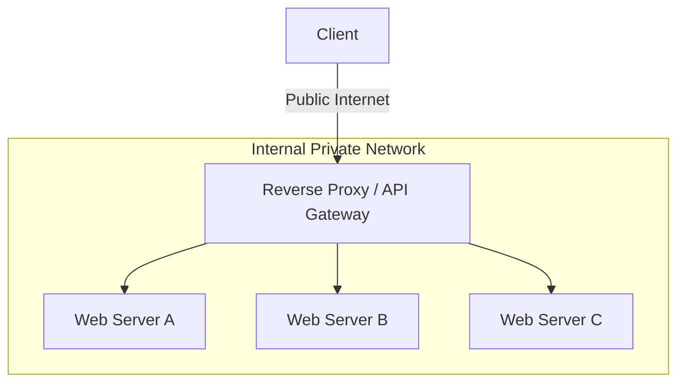

# System Architecture: Proxies & Networking Protocols

Understanding how data moves between clients and servers is critical for designing low-latency, scalable systems. This document outlines proxy architectures, fundamental transport protocols, and the API paradigms used in modern distributed applications.

---

## 1. Proxies: Forward vs. Reverse

Proxies sit between a client and a server, acting as an intermediary for network requests.

### Forward Proxy
A **Forward Proxy** sits in front of the **client**. When a client makes a request to the internet, it goes through the forward proxy.
- **Use Cases:** Bypassing geographic restrictions, content filtering (corporate networks), and caching external resources locally.
- **Security:** Hides the client's internal IP address from the destination server.

### Reverse Proxy
A **Reverse Proxy** sits in front of the **web servers**. When a client makes a request to the server, it hits the reverse proxy first.
- **Use Cases:** Load balancing, SSL termination, caching static content, and protecting internal server IPs from DDoS attacks.
- **Security:** Hides the internal servers' private IP addresses from the client.

-----

## 2. OSI Model: L4 vs. L7 Proxying

Proxies operate at different layers of the OSI (Open Systems Interconnection) model, offering varying levels of intelligence and performance.

  * **Layer 4 (Transport Layer):** Operates at the TCP/UDP level. The proxy routes traffic based purely on IP addresses and ports. It is extremely fast with low overhead because it does not inspect the application payload.
  * **Layer 7 (Application Layer):** Operates at the HTTP level. The proxy can inspect headers, cookies, and URL paths to make intelligent routing decisions (e.g., routing `/api/video` to a different server pool than `/api/images`). It is more CPU-intensive but highly flexible.

-----

## 3. Transport Layer Protocols: TCP vs. UDP

At Layer 4 of the OSI model, data is transported using either TCP or UDP. Choosing the right protocol dictates the reliability and latency of your system.

### Transmission Control Protocol (TCP)

TCP is a **connection-oriented** protocol. It establishes a connection via a 3-way handshake and guarantees that all packets reach their destination in the original order without corruption.

  - **Mechanism:** Uses sequence numbers, checksum fields, and acknowledgment packets. If the sender does not receive an acknowledgment, it automatically retransmits the packet. It also implements flow and congestion control.
  - **Best For:** High reliability over time-critical delivery (e.g., Web servers, Databases, SMTP, SSH).

### User Datagram Protocol (UDP)

UDP is a **connectionless** protocol. It fires datagrams at the destination without a handshake. It offers no guarantees of delivery, ordering, or congestion control.

  - **Mechanism:** Fire-and-forget. Datagrams may arrive out of order or be lost entirely. It also supports broadcasting (sending datagrams to all devices on a subnet, useful for DHCP).
  - **Best For:** Lowest possible latency where late data is worse than lost data (e.g., VoIP, video chat, real-time multiplayer gaming).

### ⚖️ Trade-offs

| Feature | TCP | UDP |
| :--- | :--- | :--- |
| **Reliability** | Guaranteed delivery and strict ordering. | No guarantees; packets can be lost or out of order. |
| **Speed** | Slower (handshakes, acknowledgments, retransmissions). | Extremely fast and lightweight. |
| **Overhead** | High. Keeping millions of TCP connections open requires massive memory. | Low overhead. |
| **Use Case** | File transfers, HTTP requests, text chat. | Live streaming, voice calls, gaming. |

-----

## 4. Application Layer Communication

At Layer 7, applications communicate using HTTP and its derivatives.

### Core HTTP Verbs

HTTP is a self-contained, request/response protocol. Modern systems rely on standard verbs to interact with resources:

| Verb | Description | Idempotent\* | Safe |
| :--- | :--- | :--- | :--- |
| **GET** | Reads a resource. | Yes | Yes |
| **POST** | Creates a resource or triggers a process. | No | No |
| **PUT** | Creates or fully replaces a resource. | Yes | No |
| **PATCH** | Partially updates a resource. | No | No |
| **DELETE** | Deletes a resource. | Yes | No |
*(Idempotent: Can be called multiple times without changing the outcome beyond the initial application).*

### Real-Time Communication Patterns

| Protocol | Mechanism | Direction | Best Use Case |
| :--- | :--- | :--- | :--- |
| **HTTP Short Polling** | Client repeatedly requests data at fixed intervals. | Pull | Simple status checks, low-frequency updates. |
| **Long Polling** | Server holds the HTTP connection open until new data arrives. | Pseudo-Push | Real-time updates where WebSockets aren't available. |
| **Server-Sent Events (SSE)** | Persistent connection where the server pushes updates. | Push (Uni) | Live news feeds, stock tickers, LLM token streaming. |
| **WebSockets** | Full-duplex, persistent connection via an HTTP upgrade. | Bi-directional | Multi-user chat, real-time gaming, collaborative editing. |

**Technical Trade-offs:**

  * **WebSockets:** Provide the lowest latency for bi-directional data but are **stateful**, requiring specialized load balancing (sticky sessions) and significant memory to maintain millions of open TCP connections.
  * **SSE:** Simpler to implement on the server (uses standard HTTP) and has automatic reconnection support, but it is strictly unidirectional.
  * **Polling:** Easiest to implement but creates massive overhead due to repeated HTTP headers and empty responses ("The Polling Storm").

-----

## 5. API Architectural Styles: REST vs. RPC

When designing how microservices or public clients interact, engineers typically choose between REST and RPC.

### Representational State Transfer (REST)

REST is an architectural style where the client acts on a set of **resources** managed by the server. It enforces strict decoupling between the client and server.

!!! success "Pros of REST"
    - **Uniform Interface:** Uses standard HTTP verbs (GET, POST, PUT, DELETE) applied to predictable URIs.
    - **Stateless & Scalable:** Great for horizontal scaling and load balancing.
    - **Cacheable:** Standardized HTTP headers allow responses to be easily cached by CDNs and browsers.

!!! danger "Cons of REST"
    - **Rigid Structure:** Awkward when operations don't cleanly map to resources (e.g., moving an expired document to an archive).
    - **Over-fetching / Under-fetching:** Complex UIs often require multiple round-trips to fetch nested hierarchical data, or receive bloated payloads containing unused fields.

### Remote Procedure Call (RPC)

In an RPC, a client executes a procedure on a remote server as if it were a local function call. It focuses on exposing **behaviors** rather than data resources. Popular frameworks include gRPC (Protobuf) and Apache Thrift.

!!! success "Pros of RPC"
    - **High Performance:** Often utilizes binary serialization (like Protobuf) over HTTP/2, making it incredibly fast and lightweight.
    - **Action-Oriented:** Excellent for internal microservices where complex business logic (e.g., `CalculateRiskScore`) doesn't map neatly to a database resource.

!!! danger "Cons of RPC"
    - **Tight Coupling:** Clients become strictly coupled to the service implementation.
    - **Caching Difficulty:** Because everything is typically routed through `POST` requests, traditional HTTP caching (like Squid or CDN caching) is difficult to implement.

### ⚖️ REST vs RPC Endpoint Comparison

Notice how REST focuses on the *noun* (the resource), while RPC focuses on the *verb* (the action).

| Operation | RPC Approach (Action-Oriented) | REST Approach (Resource-Oriented) |
| :--- | :--- | :--- |
| **Signup** | `POST /signup` | `POST /persons` |
| **Resign** | `POST /resign`   `{ "personid": "123" }` | `DELETE /persons/123` |
| **Read User** | `GET /readPerson?personid=123` | `GET /persons/123` |
| **Read Items**| `GET /readUsersItems?personid=123` | `GET /persons/123/items` |
| **Add Item** | `POST /addItemToUser`   `{ "personid": "123", "itemid": "45" }` | `POST /persons/123/items`   `{ "itemid": "45" }` |
| **Update Item**| `POST /modifyItem`   `{ "itemid": "45", "key": "val" }` | `PUT /items/45`   `{ "key": "val" }` |

-----

## 6. Practical Implementation

Explore the implementation of real-time communication and proxying logic within this repository:

  * **Real-time Communication:** [Infrastructure: Socket Chat App](../../../infrastructure_challenges/socket_chat_app/PROBLEM.md)
  * **Rate Limiting & Proxying:** [Infrastructure: Redis Rate Limiter](../../../infrastructure_challenges/redis_rate_limiter/PROBLEM.md)
  * **System Design (WebSockets at Scale):** [HLD: WhatsApp Lite](../../architectures/social_media/WHATSAPP.md)
