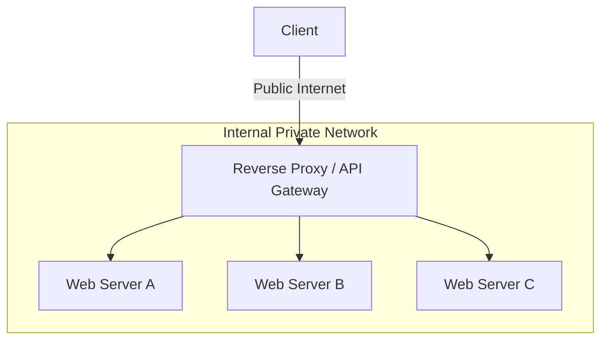

# System Architecture: Proxies & Networking Protocols

Understanding how data moves between clients and servers is critical for designing low-latency, scalable systems. This document outlines proxy architectures and the fundamental communication protocols used in modern web applications.

---

## 1. Proxies: Forward vs. Reverse

Proxies sit between a client and a server, acting as an intermediary for network requests.

### Forward Proxy
A **Forward Proxy** sits in front of the **client**. When a client makes a request to the internet, it goes through the forward proxy.
- **Use Cases:** Bypassing geographic restrictions, content filtering (corporate networks), and caching external resources locally.
- **Security:** Hides the client's internal IP address from the destination server.

### Reverse Proxy
A **Reverse Proxy** sits in front of the **web servers**. When a client makes a request to the server, it hits the reverse proxy first.
- **Use Cases:** Load balancing, SSL termination, caching static content, and protecting internal server IPs from DDoS attacks.
- **Security:** Hides the internal servers' private IP addresses from the client.

---

## 2. OSI Model: L4 vs. L7 Proxying

Proxies operate at different layers of the OSI (Open Systems Interconnection) model, offering varying levels of intelligence and performance.

*   **Layer 4 (Transport Layer):** Operates at the TCP/UDP level. The proxy routes traffic based on IP addresses and ports. It is extremely fast with low overhead because it does not inspect the application data (e.g., HTTP headers).
*   **Layer 7 (Application Layer):** Operates at the HTTP level. The proxy can inspect headers, cookies, and URL paths to make intelligent routing decisions (e.g., routing `/api/video` to a different server pool than `/api/images`). It is more CPU-intensive but much more flexible.

---

## 3. Communication Protocols

Choosing the right protocol dictates the latency, overhead, and real-time capabilities of the system.

| Protocol | Mechanism | Direction | Best Use Case |
| :--- | :--- | :--- | :--- |
| **HTTP Short Polling** | Client repeatedly requests data at fixed intervals. | Pull | Simple status checks, low-frequency updates. |
| **Long Polling** | Server holds the HTTP connection open until new data arrives. | Pseudo-Push | Real-time updates where WebSockets aren't available. |
| **Server-Sent Events (SSE)** | Persistent connection where the server pushes updates. | Push (Uni) | Live news feeds, stock tickers, LLM token streaming. |
| **WebSockets** | Full-duplex, persistent connection via an HTTP upgrade. | Bi-directional | Multi-user chat, real-time gaming, collaborative editing. |

### Technical Trade-offs
*   **WebSockets:** Provide the lowest latency for bi-directional data but are **stateful**, requiring specialized load balancing (sticky sessions) and significant memory to maintain millions of open TCP connections.
*   **SSE:** Is simpler to implement on the server (uses standard HTTP) and has automatic reconnection support, but it is strictly unidirectional.
*   **Polling:** Is the easiest to implement but creates massive overhead due to repeated HTTP headers and empty responses ("The Polling Storm").

---

## 4. Practical Implementation

Explore the implementation of real-time communication and proxying logic within this repository:

*   **Real-time Communication:** [Infrastructure: Socket Chat App](../../../infrastructure_challenges/socket_chat_app/PROBLEM.md)
*   **Rate Limiting & Proxying:** [Infrastructure: Redis Rate Limiter](../../../infrastructure_challenges/redis_rate_limiter/PROBLEM.md)
*   **System Design (WebSockets at Scale):** [HLD: WhatsApp Lite](../../architectures/social_media/WHATSAPP.md)
